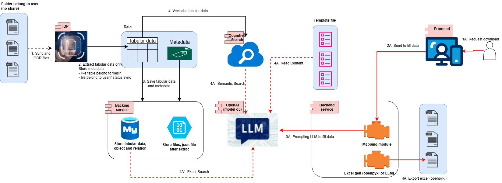

# System Architecture Design for Khengleong

| Version | Updated Date | Updated By | Reviewed By |  Note                 |
|---------|--------------|------------|-------------|-----------------------|
| 1.0.0   | 2024-31-07   | HoangPT    | TamHT       |Stubing the document   |

## System Overview

The Khengleong system is an AI-powered platform for automating financial report generation. It allows users to upload PDF and Excel files, extract data via AI, and generate standardized Excel reports based on pre-existing templates.

## 1\. Overall Architectural Analysis

### 1.1 Proposed Architectural Model: Microservices with Cloud-Native

Based on requirements analysis, the system is designed using a **Microservices Architecture** with the following characteristics:

#### **Reasons for choosing Microservices:**

  - **Modularity**: Each function (Upload & template management, AI extraction & AI mapping ) is an independent service.
  - **Scalability**: Individual services can be scaled according to demand (AI processing often requires more resources).
  - **Technology Diversity**: The AI service can use Python, while the web service can use other.
  - **Fault Isolation**: An error in one service does not affect the entire system.
  - **Team Independence**: Teams can develop and deploy independently.

#### **Architecture Pattern:**

  - **FrontEnd**: ReactJS
  - **AI Service**: For Extract, Chunking/Embeding, Mapping
  - **BE Service**: For manage Users, Templates, File Upload and Output. Working with AI for Generator.
  - **OCR**: Using Azure Form Recognizer OCR, extract tables
  - **LLM**: Using Azure OpenAI, using for mapping
  - **DB Service**: Using Azure SQL: Postgres
  - **Storage Service**: Using Azure Blobe for store output, file upload
  - **Docs Service** Using Google docs for store template
  - **Message Broker Service**: Using RabbitMQ VM

### 1.2 Deployment Model

**Cloud-Native Deployment** using containerization:

  - **Containers**: Docker containers for each microservice.
  - **Orchestration**: Docker-compose only.
  - **Monitoring**: Prometheus + Grafana stack.

### 1.3 Communication Patterns

  - **Synchronous**: REST APIs for real-time operations (upload, download).
  - **Asynchronous**: Message queues (RabbitMQ/Apache Kafka) for AI processing.
  - **Event-Driven**: Event sourcing for audit trails and state management.

## 2\. Technology Stack Recommendations

### 2.1 Frontend Technology Stack

  - **Framework**: React.js with TypeScript
  - **UI Library**: Shadcn
  - **State Management**: Context
  - **Build Tool**: Vite
  - **Testing**: Jest + React Testing Library

### 2.2 Backend Technology Stack

  - **API Gateway**: Nginx
  - **Microservices**:
      - Backend Service: FastAPI
      - AIService: Python
      - Auth Service: FastAPI

### 2.3 Database Technology Stack

  - **Primary Database**: PostgreSQL 14+
  - **Search Engine**: Elasticsearch 7+
  - **Message Queue**: RabbitMQ

### 2.4 Infrastructure Technology Stack

  - **Containerization**: Docker + Docker Compose
  - **Orchestration**: Docker Compose
  - **Cloud Provider**: Azure
  - **CI/CD**: GitLab CI
  - **Monitoring**: Prometheus + Grafana + ELK Stack

### 2.5 AI/ML Technology Stack

  - **OCR**: Azure Form Recognizer
  - **NLP**: Azure OpenAI

## 3\. Development and Deployment Strategy

### 3.1 Development Workflow

  - **GitFlow**: Feature branches, pull requests, code reviews.
  - **Test-Driven Development**: Unit tests, integration tests.
  - **Continuous Integration**: Automated testing, quality gates.
  - **Documentation**: API documentation, architecture decision records.

### 3.2 Deployment Strategy

  - **Blue-Green Deployment**: Zero-downtime deployments.
  - **Canary Releases**: Gradual rollout of new features.
  - **Infrastructure as Code**: Terraform, CloudFormation.
  - **Configuration Management**: Environment-specific configs.

## 4\. Scalability and Performance Considerations

### 4.1 Horizontal Scaling Strategy

  - **Auto-scaling**: VM Vertical Autoscaling.
  - **Database Scaling**: Read replicas, connection pooling.

### 4.2 Performance Optimization

  - **File Processing**: Parallel processing, chunk-based uploads.
  - **AI Processing**: GPU acceleration, model optimization.
  - **Database**: Query optimization, indexing strategy.
  - **Caching**: Smart caching policies, cache invalidation.

### 4.3 Reliability and Availability

  - **High Availability**: Multi-zone deployment.
  - **Disaster Recovery**: Automated backups, failover procedures.
  - **Circuit Breakers**: Prevent cascade failures.
  - **Health Checks**: Comprehensive health monitoring.

## 5\. Security Architecture

### 5.1 Security Framework

  - **Zero Trust Architecture**: Never trust, always verify.
  - **Defense in Depth**: Multiple security layers.
  - **Principle of Least Privilege**: Minimal required permissions.
  - **Security by Design**: Security considerations in every design decision.

### 5.2 Data Protection

  - **Encryption**: End-to-end encryption for sensitive data.
  - **Data Classification**: Classify data according to sensitivity levels.
  - **Data Retention**: Automated data lifecycle management.
  - **Privacy Compliance**: GDPR, CCPA compliance features.

### 5.3 Threat Mitigation

  - **OWASP Top 10**: Protection against common vulnerabilities.
  - **DDoS Protection**: Rate limiting, traffic filtering.
  - **Input Validation**: Comprehensive input sanitization.
  - **Secure Communication**: mTLS between services.

## 6\. Monitoring Strategy
### 6.1 Monitoring and Observability

  - **Application Monitoring**: APM tools (New Relic, Datadog).
  - **Infrastructure Monitoring**: System metrics, alerts.
  - **Business Metrics**: KPIs, usage analytics.
  - **Distributed Tracing**: Request tracing across services.

## 7\. Integration Patterns

### 7.1 Internal Service Communication

  - **Synchronous**: REST APIs for immediate responses.
  - **Asynchronous**: Message queues for long-running tasks.
  - **Event-Driven**: Event sourcing for audit and state sync.

### 7.2 External Integrations

  - **Cloud Services**: AWS/Azure services integration.
  - **Third-party APIs**: OCR services, ML APIs.
  - **Webhook Support**: Real-time notifications.
  - **API Versioning**: Backward compatibility.

## 8\. Compliance and Governance

### 8.1 Regulatory Compliance

  - **Financial Regulations**: SOX, Basel III compliance.
  - **Data Privacy**: GDPR, CCPA compliance.
  - **Audit Requirements**: Comprehensive audit trails.
  - **Retention Policies**: Data lifecycle management.

### 8.2 Governance Framework

  - **API Governance**: Consistent API design patterns.
  - **Data Governance**: Data quality, lineage tracking.
  - **Security Governance**: Regular security assessments.
  - **Change Management**: Controlled change processes.