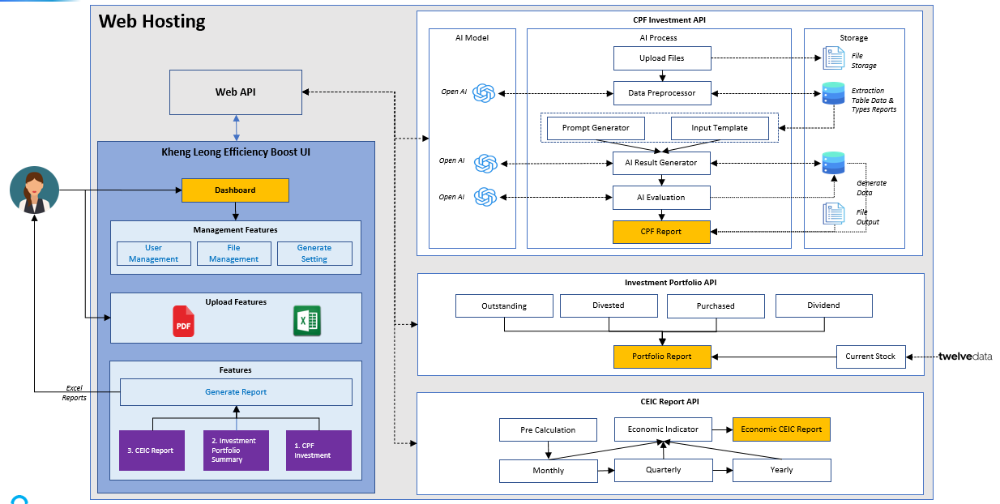

# Khengleong Project Documentation

Welcome to the technical and business documentation for the Khengleong project!

## Overview

The Khengleong project is a web application system designed to process and manage investment documents, with the following key features:

- User can upload and process data from multiple source, including document, webpages, pdf/xls, api.
- Admin and user can manage global templates and owned template.
- Preview and download the output that AI extract data and fill in template.

## Document Structure

### 📋 [Requirements](requirements/index.md)
Documentation on business requirements and project backlog

### 🔄 [User Flows](user-flows/index.md)
Detailed descriptions of user interaction flows with the system

### 🏗️ [Architecture](architecture/index.md)
Technical design, database, API, and deployment guidelines

### 🔀 [Technical Flow](tech-flows/index.md)
Module interaction, sequence diagram, module design, API Specs, DB Schema

### 🧠 [Decision Record](decision-record/index.md)
Analysis technical decision, why and how implement.

## How to Use

Use the navigation menu on the left to browse through the documentation sections. All documents are organized by specific topics for easy searching and reference.

---

*This documentation is created and maintained by the Khengleong team to support the development and implementation of the project.*