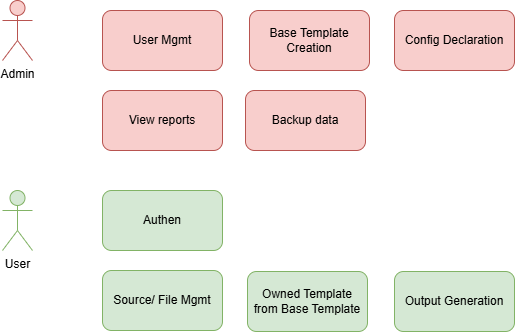

# Requirements & Business Processes

This section contains documentation on business requirements and the backlog for the Khengleong project.

## Stake Holder

There are 2 only user-type in this system: admin and staff who want to generate output and send to customer.

## Available Documentation

- **[Business Requirements)](brd.md)** - Detailed business requirements document
- **[Backlog](backlog.md)** - List of features and user stories

## How to Use

The documents are organized in the following order:
1. Read the BRD to understand the overall business context.
2. Refer to the Backlog for detailed information on the features to be implemented.