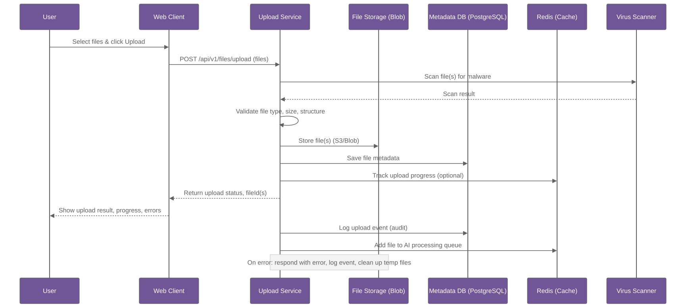

## 2\. Detailed Design of Functional Modules

### 2.1 File Upload Module

#### **Functionality:**

  - Upload multiple files (PDF, Excel) up to 5 files/report.
  - Validate file format, size, and content.
  - Temporary storage and cleanup.
  - Progress tracking for large files.

#### **Architecture:**


Refer: 


#### **Interaction Diagram: File Upload Flow**

Refer [Mermaid](../assets/tech-flows/01-upload/internal.mmd)

#### **Sequence Diagram: File Upload Flow**


Refer [Mermaid](../assets/tech-flows/01-upload/sequence.mmd)

#### **Technical Components:**

  - **Upload Service**: Node.js/Express with multer middleware.
  - **File Validation**: Magic number checking, virus scanning.
  - **Storage**: AWS S3 or Azure Blob Storage.
  - **Database**: PostgreSQL to store file metadata.
  - **Caching**: Redis for temporary file tracking.

#### **API Endpoints:**

```javascript
POST /api/v1/files/upload
GET  /api/v1/files/{fileId}/status
DELETE /api/v1/files/{fileId}
POST /api/v1/files/validate
```

#### **Security Measures:**

  - File type validation (whitelist).
  - Virus scanning integration.
  - Upload size limits.
  - Rate limiting per user.
  - Temporary URL generation with expiration.

### 2.2 AI Data Extraction Module

#### **Functionality:**

  - Extract structured data from PDF documents.
  - Parse Excel files and extract relevant tables.
  - OCR processing for scanned documents.
  - Field mapping and data normalization.
  - Confidence scoring for extracted data.

#### **Architecture:**

```
┌──────────────────┐      ┌─────────────────┐      ┌──────────────────┐
│  Queue Service   │───▶ │   AI Extract    │───▶  │   Results Cache  │
│  (RabbitMQ)      │      │   Service       │      │   (Redis)        │
└──────────────────┘      └─────────────────┘      └──────────────────┘
        ▲                       │
        │                       ▼
┌──────────────────┐      ┌─────────────────┐
│  Upload Service  │      │   ML Models     │
│                  │      │   Storage       │
└──────────────────┘      └─────────────────┘
```

#### **Technical Components:**

  - **AI Service**: Python/FastAPI with GPU support.
  - **ML Models**:
      - PDF extraction: pdfplumber, PyPDF2, Camelot
      - OCR: Tesseract, AWS Textract, Azure Form Recognizer
      - NLP: spaCy, transformers (BERT/GPT models)
  - **Message Queue**: RabbitMQ for async processing.
  - **Model Storage**: S3/Blob storage for model artifacts.
  - **Caching**: Redis for results caching.

#### **Processing Pipeline:**

1.  **File Analysis**: Determine file type and processing strategy.
2.  **Content Extraction**: Extract text, tables, and metadata.
3.  **Data Cleaning**: Remove noise, normalize formats.
4.  **Field Recognition**: Identify relevant data fields.
5.  **Validation**: Cross-check extracted data accuracy.
6.  **Output Formatting**: Structure data for template mapping.

#### **API Endpoints:**

```python
POST /api/v1/extract/process
GET  /api/v1/extract/{jobId}/status
GET  /api/v1/extract/{jobId}/results
POST /api/v1/extract/validate
```

### 2.3 Template Management Module

#### **Functionality:**

  - CRUD operations for 40 Excel templates.
  - Template versioning and history tracking.
  - Field mapping configuration.
  - Template validation and testing.
  - Bulk template operations.

#### **Architecture:**

```
┌─────────────────┐      ┌──────────────────┐      ┌─────────────────┐
│   Admin Panel   │───▶│   Template         │───▶│   Template      │
│                 │      │   Service          │      │   Storage       │
└─────────────────┘      └──────────────────┘      └─────────────────┘
                             │
                             ▼
                       ┌──────────────────┐
                       │   Mapping Config │
                       │   Database       │
                       └──────────────────┘
```

#### **Technical Components:**

  - **Template Service**: Java/Spring Boot or Node.js.
  - **Template Storage**: File system or S3 for Excel files.
  - **Configuration DB**: PostgreSQL for mapping rules.
  - **Version Control**: Git-like versioning for templates.
  - **Validation Engine**: OpenPyXL/ExcelJS for template validation.

#### **Data Model:**

```sql
-- Templates table
CREATE TABLE templates (
    id UUID PRIMARY KEY,
    name VARCHAR(255) NOT NULL,
    description TEXT,
    file_path VARCHAR(500),
    version INTEGER DEFAULT 1,
    status ENUM('active', 'deprecated', 'draft'),
    created_at TIMESTAMP,
    updated_at TIMESTAMP
);

-- Field mappings table
CREATE TABLE field_mappings (
    id UUID PRIMARY KEY,
    template_id UUID REFERENCES templates(id),
    field_name VARCHAR(255),
    cell_reference VARCHAR(10),
    data_type VARCHAR(50),
    validation_rules JSONB,
    created_at TIMESTAMP
);
```

#### **API Endpoints:**

```javascript
GET    /api/v1/templates
POST   /api/v1/templates
GET    /api/v1/templates/{templateId}
PUT    /api/v1/templates/{templateId}
DELETE /api/v1/templates/{templateId}
POST   /api/v1/templates/{templateId}/mappings
GET    /api/v1/templates/{templateId}/preview
```

### 2.4 Report Preview & Download Module

#### **Functionality:**

  - Generate Excel reports from extracted data and templates.
  - HTML preview of generated reports.
  - Download management with tracking.
  - Report history and archival.
  - Batch report generation.

#### **Architecture:**

```
┌─────────────────┐      ┌──────────────────┐      ┌─────────────────┐
│   Web Client    │───▶│   Report           │───▶│   Report        │
│                 │      │   Service          │      │   Storage       │
└─────────────────┘      └──────────────────┘      └─────────────────┘
                             │
                             ▼
                       ┌──────────────────┐
                       │   Template +     │
                       │   Data Merger    │
                       └──────────────────┘
```

#### **Technical Components:**

  - **Report Service**: Node.js/Express or Python/Django.
  - **Excel Generation**: ExcelJS, OpenPyXL, or Apache POI.
  - **Preview Generator**: HTML/CSS converter for Excel preview.
  - **Report Storage**: S3/Blob storage for generated reports.
  - **Download Tracking**: Database logs for download history.

#### **Generation Process:**

1.  **Data Retrieval**: Fetch extracted data from cache/database.
2.  **Template Loading**: Load selected Excel template.
3.  **Data Mapping**: Apply field mappings to populate cells.
4.  **Validation**: Verify data integrity and format.
5.  **Generation**: Create final Excel file.
6.  **Preview Creation**: Generate HTML preview.
7.  **Storage**: Save report with metadata.

#### **API Endpoints:**

```javascript
POST /api/v1/reports/generate
GET  /api/v1/reports/{reportId}/preview
GET  /api/v1/reports/{reportId}/download
GET  /api/v1/reports/history
POST /api/v1/reports/batch-generate
```

### 2.5 Security and Access Control Module

#### **Functionality:**

  - User authentication and authorization.
  - Role-based access control (RBAC).
  - API security and rate limiting.
  - Data encryption (at rest and in transit).
  - Session management.

#### **Architecture:**

```
┌─────────────────┐      ┌──────────────────┐      ┌─────────────────┐
│   Client Apps   │───▶│   Auth Service     │───▶│   User Database │
│                 │      │   (OAuth2/JWT)     │      │                 │
└─────────────────┘      └──────────────────┘      └─────────────────┘
        │                       │
        ▼                       ▼
┌─────────────────┐      ┌──────────────────┐
│   API Gateway   │      │   Permission     │
│   (Rate Limit)  │      │   Database       │
└─────────────────┘      └──────────────────┘
```

#### **Technical Components:**

  - **Auth Service**: OAuth 2.0/OpenID Connect with JWT tokens.
  - **Identity Provider**: Keycloak, Auth0, or custom solution.
  - **API Gateway**: Kong, Zuul, or AWS API Gateway.
  - **Encryption**: AES-256 for data at rest, TLS 1.3 for data in transit.
  - **WAF**: Web Application Firewall for attack protection.

#### **Security Layers:**

1.  **Authentication**: Multi-factor authentication support.
2.  **Authorization**: Role-based permissions (Admin, User, Viewer).
3.  **Network Security**: VPC, security groups, firewall rules.
4.  **Data Security**: Field-level encryption for sensitive data.
5.  **Audit Trail**: Security event logging.
6.  **Compliance**: GDPR, SOX compliance features.

#### **Role Definitions:**

```yaml
roles:
  admin:
    permissions:
      - template.create
      - template.update
      - template.delete
      - user.manage
      - audit.view
  
  user:
    permissions:
      - file.upload
      - report.generate
      - report.download
      - template.view
  
  viewer:
    permissions:
      - report.view
      - report.download
```


### 2.6 Logging & Audit Trail Module

#### **Functionality:**

  - Comprehensive activity logging.
  - Audit trail for compliance.
  - Performance monitoring.
  - Error tracking and alerting.
  - Business intelligence dashboards.

#### **Architecture:**

```
┌─────────────────┐      ┌──────────────────┐      ┌─────────────────┐
│   All Services  │───▶│   Logging          │───▶│   Log Storage   │
│   (Log Events)  │      │   Aggregator       │      │   (ELK Stack)   │
└─────────────────┘      └──────────────────┘      └─────────────────┘
                             │
                             ▼
                       ┌──────────────────┐
                       │   Monitoring &   │
                       │   Alerting       │
                       └──────────────────┘
```

#### **Technical Components:**

  - **Log Aggregation**: ELK Stack (Elasticsearch, Logstash, Kibana).
  - **Metrics Collection**: Prometheus + Grafana.
  - **Error Tracking**: Sentry or Rollbar.
  - **Audit Database**: Separate PostgreSQL database.
  - **Alerting**: PagerDuty, Slack integration.

#### **Logging Categories:**

1.  **Application Logs**: Service-specific logs with a structured format.
2.  **Access Logs**: API access, user sessions, authentication.
3.  **Business Logs**: File uploads, report generations, template usage.
4.  **Security Logs**: Failed authentications, suspicious activities.
5.  **Performance Logs**: Response times, resource usage, errors.

#### **Audit Trail Schema:**

```sql
CREATE TABLE audit_logs (
    id UUID PRIMARY KEY,
    timestamp TIMESTAMP NOT NULL,
    user_id UUID,
    session_id VARCHAR(255),
    action VARCHAR(100) NOT NULL,
    resource_type VARCHAR(50),
    resource_id VARCHAR(255),
    details JSONB,
    ip_address INET,
    user_agent TEXT,
    status VARCHAR(20),
    created_at TIMESTAMP DEFAULT NOW()
);

CREATE INDEX idx_audit_logs_user_timestamp ON audit_logs(user_id, timestamp);
CREATE INDEX idx_audit_logs_action ON audit_logs(action);
CREATE INDEX idx_audit_logs_timestamp ON audit_logs(timestamp);
```