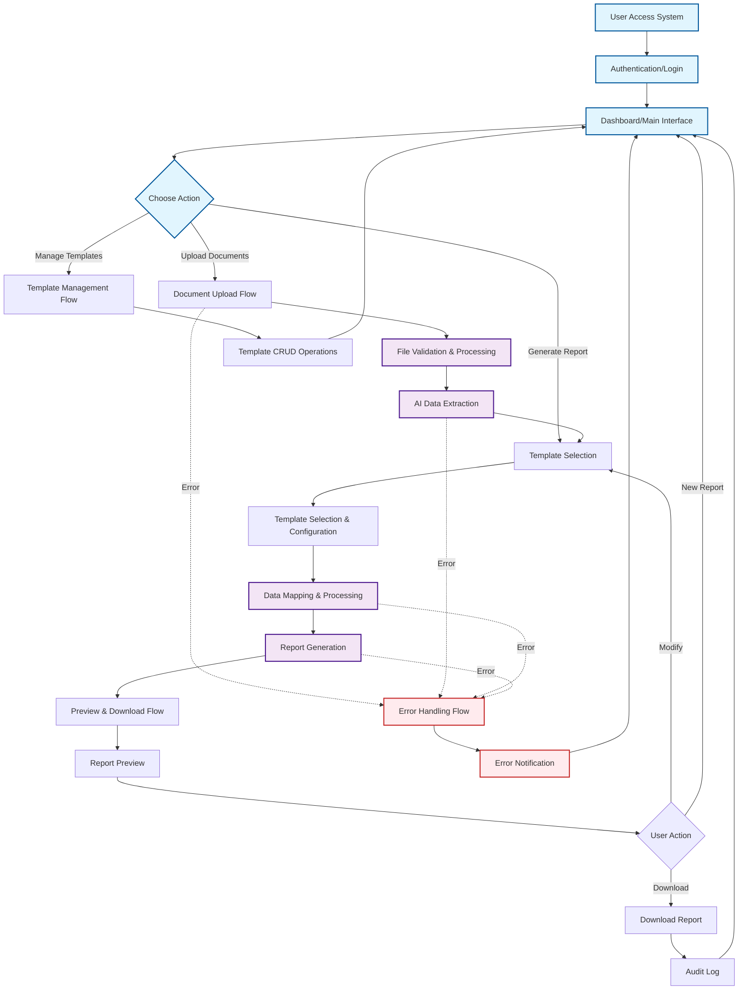
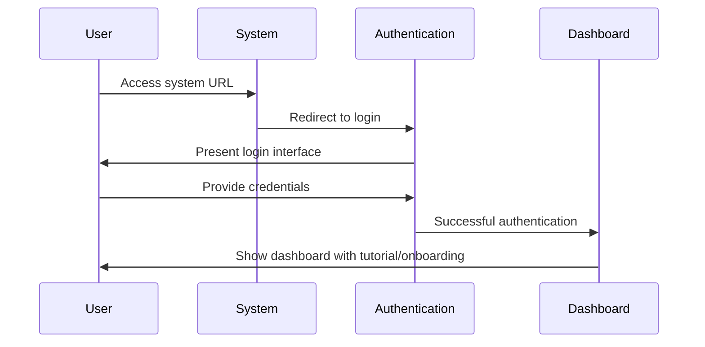
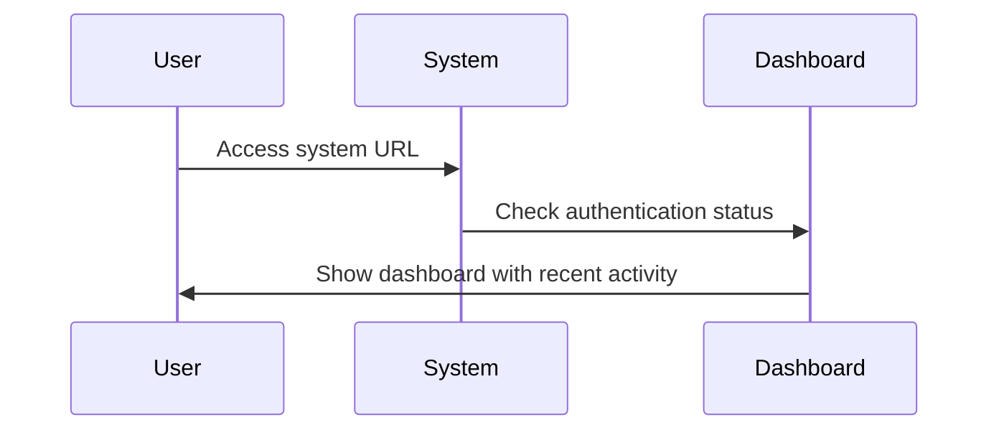

# Complete User Journey - Khengleong System

## Overview

This document provides an end-to-end overview of the user journey through the Khengleong Financial Report Generation System, covering all major interaction flows from initial access to final report download.

## High-Level User Journey Flow

## User Personas and Scenarios

### Primary User: Financial Analyst
**Goal**: Generate standardized financial reports quickly and accurately

**Typical Journey**:
1. Access system via Chrome browser
2. Upload 2-5 source documents (PDFs, Excel files)
3. Select appropriate output template from 40 available options
4. Review AI-extracted data mapping
5. Generate and preview report
6. Download final Excel report
7. Repeat process for multiple reports

### Secondary User: Template Administrator
**Goal**: Manage and maintain output templates

**Typical Journey**:
1. Access template management section
2. Add new templates or modify existing ones
3. Configure data mapping rules
4. Test template with sample data
5. Publish template for general use

## Key User Experience Principles

### 1. Simplicity and Clarity
- Intuitive navigation suitable for non-technical users
- Clear visual indicators for each process step
- Contextual help and tooltips throughout the interface

### 2. Efficiency and Speed
- Streamlined workflows to minimize clicks
- Real-time feedback during processing
- Quick access to frequently used templates and actions

### 3. Reliability and Trust
- Clear error messages with actionable guidance
- Progress indicators for long-running processes
- Comprehensive audit trail for all actions

### 4. Flexibility within Constraints
- Template selection based on document type and use case
- Preview capabilities before final download
- Ability to iterate and refine reports

## System Entry Points

### 1. New User First Visit

### 2. Returning User

## Success Metrics and Validation

### User Experience Metrics
- **Time to Complete Report**: Target < 5 minutes from upload to download
- **Error Rate**: < 5% of document processing attempts
- **User Satisfaction**: Measured through task completion rates and user feedback

### System Performance Metrics
- **Processing Speed**: 5-25 seconds per document extraction
- **Concurrent Users**: Support up to 10 simultaneous users
- **System Uptime**: 99% availability target

## Integration with Other Flows

This overview connects to detailed flows:

1. **[Document Upload Flow](./01-document-upload-flow.md)** - Handles file upload and validation
2. **[Template Selection Flow](./02-template-selection-flow.md)** - Template choosing and configuration
3. **[Template Management Flow](./03-template-management-flow.md)** - Administrative template operations
4. **[Preview and Download Flow](./04-preview-download-flow.md)** - Report review and download
5. **[Error Handling Flow](./05-error-handling-flow.md)** - Comprehensive error management

## Future Considerations

### Phase 2 Enhancements
- Integration with external document repositories
- Advanced chart extraction and insertion
- Expanded template library beyond 40 templates
- Mobile browser support
- Real-time collaboration features

### Scalability Considerations
- Horizontal scaling architecture for increased user load
- Advanced caching for frequently used templates
- Enhanced AI model capabilities for better data extraction accuracy