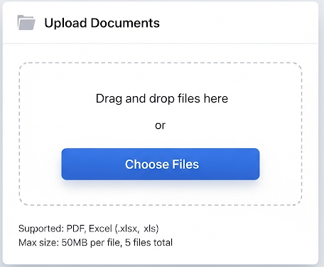
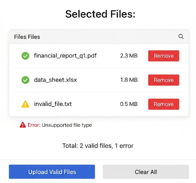
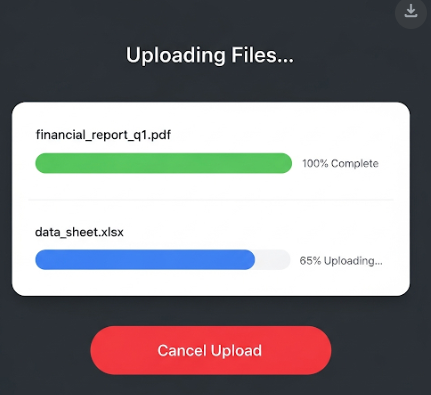

# Document Upload Flow - Upload Tài Liệu

## Overview

This document describes the user interaction flow for uploading documents (PDF and Excel files) to the Khengleong system. This is the primary entry point for users to input source data for report generation.

## Business Requirements Supported

- **BR 1**: User shall be able to upload input files (PDF, Excel) - Critical Priority
- **NFR 5**: Secure storage of uploaded files (access control, encryption at rest/in transit)
- **NFR 6**: Auto-clean temporary files/logs to prevent data leakage
- **NFR 10**: Audit/log all actions (upload, generate, error) with timestamps and user IDs

## Upload Flow Diagram

[Refer: Mermaid Language](../assets/user-flows/01-document-upload-flow/flow.mmd)

## Detailed User Flow Steps

### 1. Initiation
**User Action**: User navigates to upload section from dashboard
**System Response**: 
- Display upload interface with clear instructions
- Show supported file types (PDF, Excel)
- Display file size limitations
- Show current upload quota/limits

### 2. File Selection
**User Action**: User selects files using file picker or drag-and-drop
**System Response**:
- Real-time file validation as files are selected
- Display file details (name, size, type)
- Show upload preview with file list

### 3. Pre-Upload Validation

#### File Type Validation

[Refer: Mermaid Language](../assets/user-flows/01-document-upload-flow/file-validation.mmd)

#### Validation Rules
- **File Types**: Only PDF (.pdf) and Excel (.xlsx, .xls) files
- **File Size**: Maximum 50MB per file
- **Total Upload**: Maximum 5 files per upload session
- **File Integrity**: Basic file structure validation
- **Naming**: No special characters that could cause security issues

### 4. Upload Process
**User Action**: Confirms upload by clicking "Upload Files" button
**System Process**:
1. **Progress Tracking**: Real-time upload progress bar for each file
2. **Chunked Upload**: Large files uploaded in chunks for reliability
3. **Error Recovery**: Automatic retry for failed chunks
4. **Timeout Handling**: 5-minute timeout per file with user notification

### 5. Security Processing
**System Process**:
1. **Virus Scanning**: All uploaded files scanned for malware
2. **Content Validation**: Deeper file structure and content validation
3. **Metadata Sanitization**: Remove potentially sensitive metadata
4. **Encryption**: Files encrypted at rest using AES-256

### 6. Post-Upload Processing
**System Process**:
1. **File Storage**: Secure storage with access controls
2. **Activity Logging**: Log upload details with timestamp and user ID
3. **AI Queue**: Files added to processing queue for data extraction
4. **User Notification**: Success confirmation with next steps

## User Interface Requirements

### Upload Interface Components

#### 1. File Selection Area

#### 2. File List Display

#### 3. Upload Progress

## Error Scenarios and Handling

### 1. File Validation Errors
| Error Type | User Message | User Action |
|------------|-------------|-------------|
| Unsupported file type | "Only PDF and Excel files are supported. Please select a different file." | Remove file and select valid type |
| File too large | "File exceeds 50MB limit. Please compress or select a smaller file." | Replace with smaller file |
| Corrupted file | "File appears to be corrupted. Please check the file and try again." | Re-save or replace file |
| Too many files | "Maximum 5 files allowed per upload. Please remove some files." | Remove excess files |

### 2. Upload Process Errors
| Error Type | User Message | System Action |
|------------|-------------|---------------|
| Network timeout | "Upload timed out. Please check your connection and try again." | Retain selected files for retry |
| Server error | "Server temporarily unavailable. Please try again in a few minutes." | Log error, notify administrators |
| Disk space | "Server storage full. Please contact administrator." | Alert system administrators |
| Security scan failure | "File failed security check. Please ensure file is from a trusted source." | Quarantine file, log security event |

### 3. Recovery Actions
- **Automatic Retry**: Failed uploads automatically retry up to 3 times
- **Resume Upload**: Partially uploaded files can be resumed
- **Clear State**: Users can clear all selected files and start over
- **Save Session**: Upload session state saved in case of page refresh

## Integration Points

### 1. With Template Selection Flow
- Successfully uploaded files automatically trigger template selection
- File metadata passed to template selection for intelligent recommendations

### 2. With AI Processing
- Files queued for AI data extraction
- Processing status tracked and reported to user

### 3. With Audit System
- All upload activities logged with user ID, timestamp, file details
- Failed uploads and security events logged for monitoring

### 4. With Error Handling Flow
- All error scenarios integrate with central error handling system
- User notifications consistent with system-wide error messaging

## Performance Considerations

### Upload Optimization
- **Chunked Upload**: Files uploaded in 1MB chunks for reliability
- **Parallel Processing**: Multiple files can upload simultaneously
- **Progress Feedback**: Real-time progress updates for user experience
- **Compression**: Optional client-side compression for large files

### Storage Management
- **Auto-cleanup**: Temporary files cleaned after processing
- **Retention Policy**: Source files retained for audit purposes per policy
- **Space Monitoring**: System monitors available storage space
- **Backup Strategy**: Uploaded files included in system backup procedures

## Security Measures

### File Security
- **Virus Scanning**: Real-time malware detection
- **Content Validation**: Deep file structure analysis
- **Sandboxing**: Files processed in isolated environment
- **Access Control**: Role-based access to uploaded files

### Data Protection
- **Encryption at Rest**: AES-256 encryption for stored files
- **Encryption in Transit**: TLS 1.3 for all upload communications
- **Metadata Scrubbing**: Remove potentially sensitive file metadata
- **Audit Trail**: Complete logging of all file access and operations