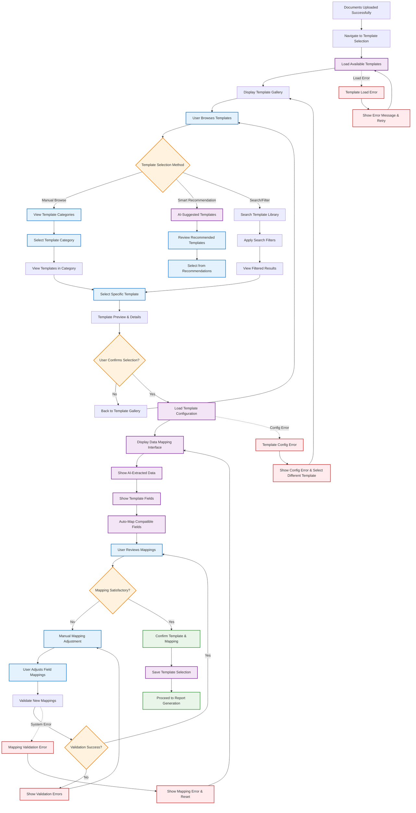
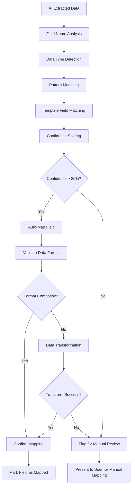

# Template Selection Flow - Chọn Template Đầu Ra

## Overview

This document describes the user interaction flow for selecting output templates after successful document upload. Users choose from up to 40 predefined Excel templates and configure data mapping for report generation.

## Business Requirements Supported

- **BR 3**: System shall allow users to select a predefined output Excel template - High Priority
- **BR 4**: System shall map extracted data into correct cells of the selected Excel template - High Priority
- **NFR 8**: Externalized, editable config files for template mappings/rules
- **NFR 9**: Intuitive UI for non-technical users with tooltips

## Template Selection Flow Diagram



## Template Library Organization

### Template Categories

```mermaid
graph TD
    A[Template Library - 40 Templates] --> B[Bond Coverage Reports]
    A --> C[Stock Coverage Reports]
    A --> D[Quarterly Statistics]
    A --> E[Investment Analysis]
    A --> F[Risk Assessment]
    A --> G[Compliance Reports]
    
    B --> B1[Tencent Bond Analysis]
    B --> B2[UBS Bond Coverage]
    B --> B3[BNP Bond Reports]
    
    C --> C1[Xiaomi Stock Analysis]
    C --> C2[Tech Stock Coverage]
    C --> C3[Market Performance]
    
    D --> D1[CPF Quarterly Stats]
    D --> D2[Portfolio Performance]
    D --> D3[Risk Metrics]
    
    E --> E1[Investment Recommendations]
    E --> E2[Asset Allocation]
    E --> E3[Performance Analysis]
    
    F --> F1[Market Risk Reports]
    F --> F2[Credit Risk Analysis]
    F --> F3[Operational Risk]
    
    G --> G1[Regulatory Compliance]
    G --> G2[Audit Reports]
    G --> G3[Disclosure Documents]
```



## Detailed User Flow Steps

### 1. Template Gallery Display

**System Process**: Load and display available templates
**Interface Layout**:
```
┌─────────────────────────────────────────────────────────┐
│  🏛️ Select Output Template                               │
│                                                         │
│  📊 Smart Recommendations (3 templates)                 │
│  ┌─────────┐ ┌─────────┐ ┌─────────┐                   │
│  │Template │ │Template │ │Template │                   │
│  │   A     │ │   B     │ │   C     │                   │
│  │ 95% fit │ │ 87% fit │ │ 82% fit │                   │
│  └─────────┘ └─────────┘ └─────────┘                   │
│                                                         │
│  🗂️ Browse by Category                                  │
│  [Bond Coverage] [Stock Analysis] [Quarterly Reports]   │
│  [Risk Assessment] [Compliance] [All Templates]         │
│                                                         │
│  🔍 Search Templates                                     │
│  [Search box: "Enter keywords..."]    [🔍 Search]       │
└─────────────────────────────────────────────────────────┘
```

### 2. Smart Recommendations

**AI Process**: Analyze uploaded documents to suggest templates
**Recommendation Logic**:
- **Document Type Analysis**: PDF structure, Excel schema recognition
- **Content Analysis**: Key financial terms, data patterns
- **Historical Usage**: Similar document combinations
- **Confidence Scoring**: Percentage match likelihood

### 3. Template Preview and Details

**User Action**: Click on template for detailed view
**Interface Layout**:
```
┌─────────────────────────────────────────────────────────┐
│  Template: Tencent Bond Analysis Report                 │
│                                                         │
│  📋 Description:                                        │
│  Comprehensive bond analysis template for Tencent      │
│  securities including credit rating, yield analysis,   │
│  and risk assessment metrics.                          │
│                                                         │
│  📊 Template Preview:                                   │
│  [Mini Excel preview showing template structure]       │
│                                                         │
│  🔧 Required Data Fields:                              │
│  • Bond ISIN Code                                      │
│  • Credit Rating                                       │
│  • Yield to Maturity                                   │
│  • Coupon Rate                                         │
│  • Maturity Date                                       │
│                                                         │
│  ✅ Compatibility: 95% match with uploaded documents    │
│                                                         │
│  [📖 View Full Template] [✔️ Select This Template]      │
└─────────────────────────────────────────────────────────┘
```

### 4. Data Mapping Interface

**System Process**: Display extracted data and template fields side-by-side
**Interface Layout**:
```
┌─────────────────────────────────────────────────────────┐
│  📋 Data Mapping Configuration                          │
│                                                         │
│  ┌─────────────────────┐ ┌─────────────────────────────┐ │
│  │  Extracted Data     │ │     Template Fields         │ │
│  │                     │ │                             │ │
│  │ ✓ Bond ISIN:        │ │ → A1: Bond Identifier       │ │
│  │   HK0000123456      │ │                             │ │
│  │                     │ │ → B5: Credit Rating         │ │
│  │ ✓ Rating: AAA       │ │                             │ │
│  │                     │ │ → C10: Yield Rate           │ │
│  │ ✓ Yield: 3.25%      │ │                             │ │
│  │                     │ │ → D15: Coupon Rate          │ │
│  │ ✓ Coupon: 4.0%      │ │                             │ │
│  │                     │ │ → E20: Maturity Date        │ │
│  │ ✓ Maturity:         │ │                             │ │
│  │   2025-12-31        │ │                             │ │
│  │                     │ │                             │ │
│  │ ⚠ Unmapped:         │ │ ❌ Unmapped Fields:         │ │
│  │   Market Cap        │ │   Risk Score                │ │
│  │   Volume            │ │   Analyst Rating            │ │
│  └─────────────────────┘ └─────────────────────────────┘ │
│                                                         │
│  Mapping Status: 5/7 fields mapped automatically       │
│  [🔄 Re-run Auto Mapping] [✏️ Manual Adjust] [✔️ Confirm] │
└─────────────────────────────────────────────────────────┘
```

### 5. Manual Mapping Adjustment

**User Action**: Drag and drop or click to map fields manually
**Interface Features**:
- **Drag-and-Drop**: Intuitive field mapping
- **Auto-complete**: Suggest field matches as user types
- **Validation**: Real-time validation of mapping compatibility
- **Undo/Redo**: Allow users to revert mapping changes

## Template Selection Methods

### 1. Smart Recommendations (AI-Powered)


**Analysis Factors**:
- **Document Keywords**: Financial terms, company names, report types
- **Data Structure**: Table layouts, chart types, data formats
- **Historical Patterns**: Previous successful template selections
- **User Preferences**: Learning from user selection history

### 2. Category-Based Browsing

**Category Structure**:
- **Bond Coverage** (12 templates)
  - Corporate bonds, government bonds, municipal bonds
  - Different credit ratings and market sectors
- **Stock Analysis** (15 templates)
  - Individual stock reports, sector analysis, market comparison
  - Different time horizons and analysis depths
- **Quarterly Reports** (8 templates)
  - CPF statistics, portfolio performance, regulatory reports
- **Risk Assessment** (5 templates)
  - Market risk, credit risk, operational risk templates

### 3. Search and Filter

**Search Capabilities**:
- **Keyword Search**: Template names, descriptions, field names
- **Filter Options**:
  - Document type compatibility
  - Industry sector (tech, finance, healthcare, etc.)
  - Report frequency (daily, weekly, monthly, quarterly)
  - Complexity level (basic, intermediate, advanced)
  - Last used date

## Data Mapping Logic

### Automatic Mapping Algorithm



### Mapping Validation Rules

| Data Type | Validation Rules | Error Handling |
|-----------|------------------|----------------|
| **Date** | ISO format, valid date range | Show format example, suggest corrections |
| **Number** | Numeric format, reasonable range | Highlight invalid characters, suggest format |
| **Currency** | Currency symbol, decimal places | Auto-convert currency formats |
| **Text** | Length limits, special characters | Truncate with warning, escape special chars |
| **Percentage** | 0-100% range, format consistency | Convert decimal to percentage if needed |

## Error Scenarios and Handling

### 1. Template Loading Errors

| Error Type | Cause | User Message | Recovery Action |
|------------|-------|-------------|-----------------|
| Template not found | Missing template file | "Template temporarily unavailable. Please select another template." | Redirect to template gallery |
| Corrupted template | File corruption | "Template file corrupted. Please contact administrator." | Disable template, suggest alternatives |
| Permission denied | Access control issue | "You don't have permission to use this template." | Filter out restricted templates |

### 2. Data Mapping Errors

| Error Type | User Message | Recovery Action |
|------------|-------------|-----------------|
| No compatible fields | "No matching fields found. Please select a different template or upload different documents." | Suggest alternative templates |
| Data format mismatch | "Data format incompatible with template requirements. Please review mapping." | Provide format examples and conversion options |
| Required field missing | "Required field 'X' not found in uploaded documents. Please map manually or upload additional data." | Highlight missing fields, allow manual input |

### 3. Performance Issues

| Scenario | Detection | User Experience | System Action |
|----------|-----------|-----------------|---------------|
| Slow template loading | Response time > 10 seconds | Progress indicator with estimated time | Cache frequently used templates |
| Large document processing | File size > 20MB | "Processing large document, please wait..." | Process in background, show progress |
| High user load | Concurrent users > 8 | "System busy, please wait..." | Queue requests, load balance |

## Integration Points

### 1. With Document Upload Flow
- Receive uploaded file metadata and extracted data
- Inherit file processing status and any extraction errors
- Pass document context to template recommendation engine

### 2. With Template Management Flow
- Access to template library and metadata
- Real-time template availability status
- Template versioning and update notifications

### 3. With Preview and Download Flow
- Pass selected template and mapping configuration
- Provide data mapping validation results
- Transfer control for report generation process

### 4. With Error Handling Flow
- Consistent error messaging and logging
- Error recovery mechanisms
- User guidance for error resolution

## Performance Optimization

### Template Loading
- **Lazy Loading**: Load template details only when requested
- **Caching**: Cache frequently accessed templates in memory
- **Compression**: Compress template metadata for faster transfer
- **CDN**: Use content delivery network for template assets

### Recommendation Engine
- **Background Processing**: Pre-compute recommendations during upload
- **Result Caching**: Cache recommendation results for similar documents
- **Incremental Updates**: Update recommendations as more data becomes available

## User Experience Enhancements

### Accessibility Features
- **Keyboard Navigation**: Full keyboard support for template selection
- **Screen Reader Support**: Proper ARIA labels and descriptions
- **High Contrast Mode**: Support for visual accessibility preferences
- **Responsive Design**: Optimize for different screen sizes

### Usability Features
- **Recently Used**: Quick access to recently selected templates
- **Favorites**: Allow users to bookmark frequently used templates
- **Preview Mode**: Quick preview without full template loading
- **Comparison View**: Compare multiple templates side-by-side