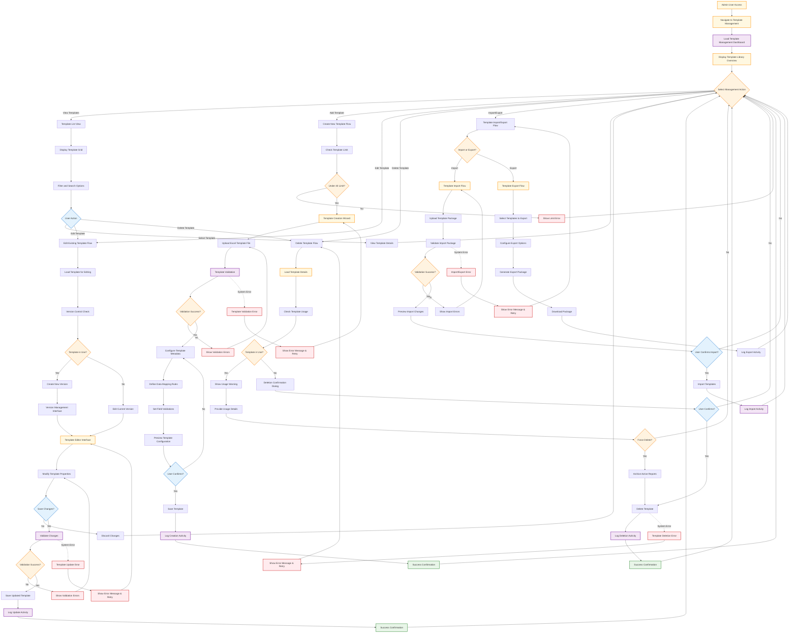
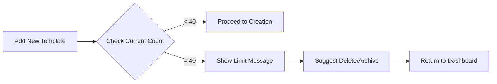
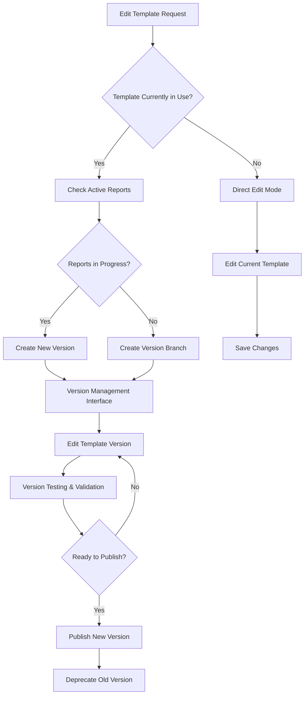
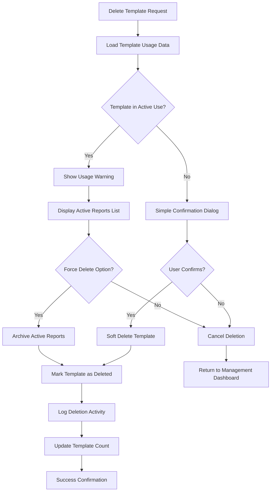
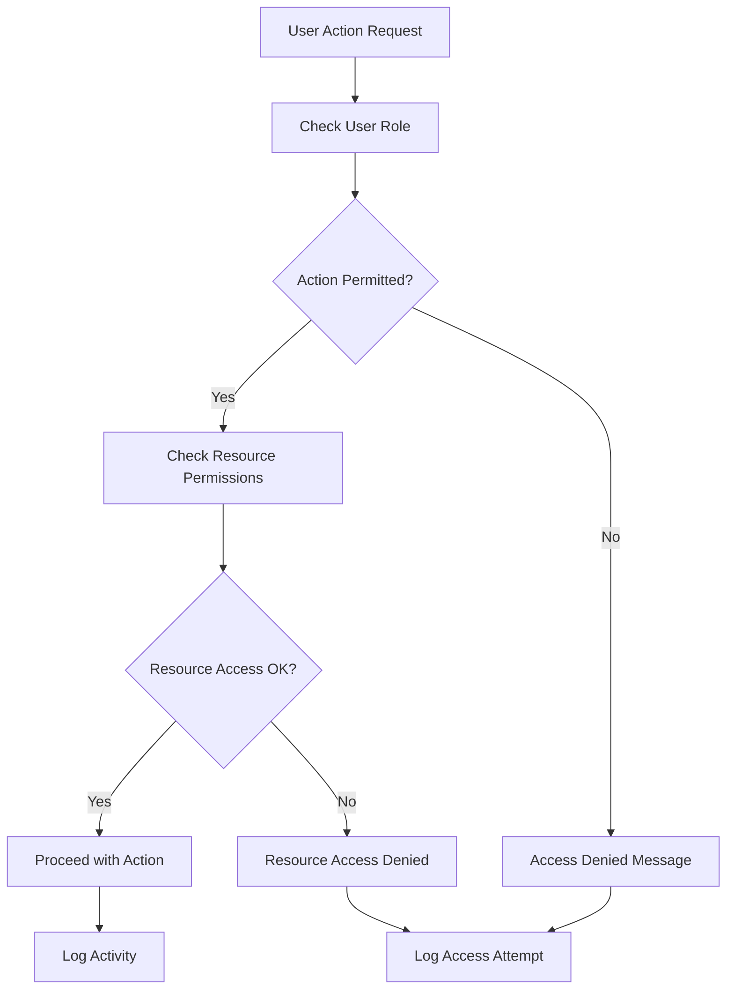
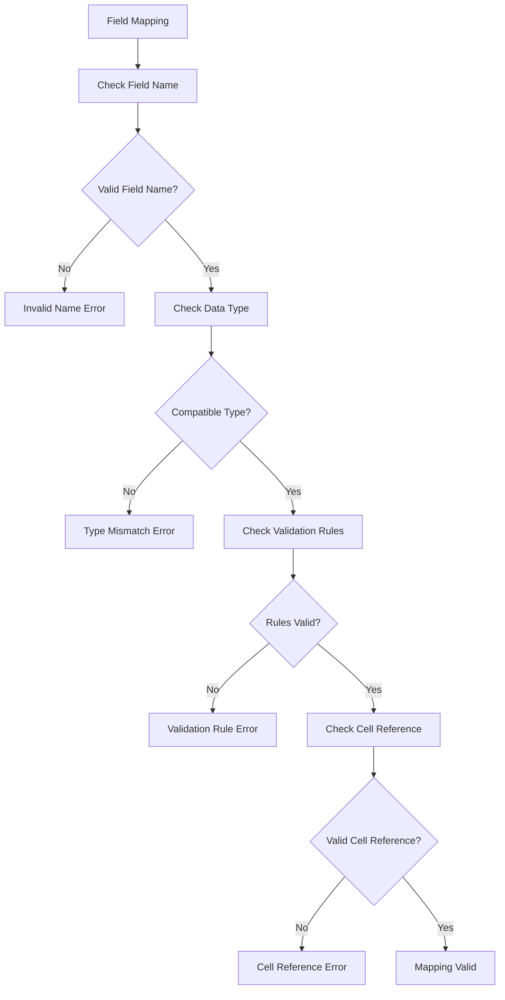
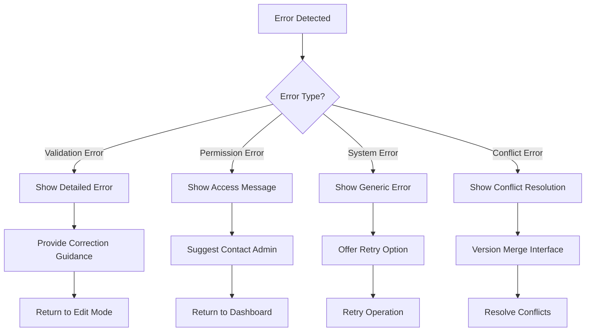

# Template Management Flow - Quản Lý Template

## Overview

This document describes the administrative user interaction flow for managing output templates in the Khengleong system. This includes creating, updating, deleting, and configuring templates within the constraint of 40 predefined templates for Phase 1.

## Business Requirements Supported

- **BR 7**: User shall be able to manage (add/update/delete) output templates - Medium Priority
- **NFR 8**: Externalized, editable config files for template mappings/rules
- **NFR 10**: Audit/log all actions with timestamps and user IDs

## Template Management Flow Diagram



## Template Management Dashboard

### Main Interface Layout

```
┌─────────────────────────────────────────────────────────┐
│  🛠️ Template Management Dashboard                        │
│                                                         │
│  📊 Library Overview                                     │
│  ┌─────────────────────────────────────────────────────┐ │
│  │ Total Templates: 37/40        Active: 35             │ │
│  │ Recent Activity: 3 updates    Categories: 6          │ │
│  │                                                     │ │
│  │ [📝 Add New Template] [📤 Import] [📥 Export]        │ │
│  └─────────────────────────────────────────────────────┘ │
│                                                         │
│  🔍 Filter Templates                                     │
│  Category: [All ▼] Status: [All ▼] Last Modified: [All ▼] │
│  Search: [Enter template name...] [🔍]                  │
│                                                         │
│  📋 Template Library                                     │
│  ┌─────────────────────────────────────────────────────┐ │
│  │ Template Name          Category    Status   Actions  │ │
│  │ ─────────────          ────────    ──────   ─────── │ │
│  │ Tencent Bond Analysis  Bond        Active   [E][D]  │ │
│  │ Xiaomi Stock Report    Stock       Active   [E][D]  │ │
│  │ CPF Quarterly Stats    Quarterly   Draft    [E][D]  │ │
│  │ UBS Bond Coverage      Bond        Active   [E][D]  │ │
│  │ Risk Assessment v2     Risk        Inactive [E][D]  │ │
│  └─────────────────────────────────────────────────────┘ │
└─────────────────────────────────────────────────────────┘

Legend: [E] = Edit, [D] = Delete, [V] = View Details
```

## Detailed Management Flows

### 1. Create New Template Flow

#### Step 1: Template Limit Check


#### Step 2: Template Creation Wizard

**Interface Layout**:
```
┌─────────────────────────────────────────────────────────┐
│  📝 Create New Template - Step 1 of 4                   │
│                                                         │
│  📁 Upload Excel Template File                          │
│  ┌─────────────────────────────────────────────────────┐ │
│  │ Drag and drop your Excel template here             │ │
│  │               or                                   │ │
│  │        [Choose Excel File]                         │ │
│  │                                                     │ │
│  │ Requirements:                                       │ │
│  │ • Excel format (.xlsx, .xlsm)                     │ │
│  │ • Maximum 10MB file size                          │ │
│  │ • Named cell ranges for data fields               │ │
│  │ • No external links or macros                     │ │
│  └─────────────────────────────────────────────────────┘ │
│                                                         │
│  [⬅️ Cancel] [➡️ Next Step]                              │
└─────────────────────────────────────────────────────────┘
```

#### Step 3: Template Metadata Configuration

**Interface Layout**:
```
┌─────────────────────────────────────────────────────────┐
│  📝 Create New Template - Step 2 of 4                   │
│                                                         │
│  📋 Template Information                                 │
│  Template Name: [_________________________]             │
│  Description:   [_________________________]             │
│                 [_________________________]             │
│  Category:      [Bond Coverage ▼]                       │
│  Industry:      [Financial Services ▼]                  │
│  Frequency:     [Quarterly ▼]                          │
│  Complexity:    [● Basic ○ Intermediate ○ Advanced]     │
│                                                         │
│  🏷️ Tags (comma-separated):                             │
│  [bonds, tencent, analysis, quarterly]                  │
│                                                         │
│  📄 Template Preview:                                    │
│  [Excel preview showing template structure]             │
│                                                         │
│  [⬅️ Previous] [➡️ Next Step]                            │
└─────────────────────────────────────────────────────────┘
```

#### Step 4: Data Mapping Configuration

**Interface Layout**:
```
┌─────────────────────────────────────────────────────────┐
│  📝 Create New Template - Step 3 of 4                   │
│                                                         │
│  🔗 Configure Data Mapping Rules                        │
│                                                         │
│  ┌─────────────────────┐ ┌─────────────────────────────┐ │
│  │ Template Fields     │ │ Data Field Configuration    │ │
│  │                     │ │                             │ │
│  │ ✓ A1: Bond_ISIN     │ │ Field Name: Bond ISIN       │ │
│  │ ✓ B5: Credit_Rating │ │ Data Type: Text             │ │
│  │ ✓ C10: Yield_Rate   │ │ Required: ☑️                 │ │
│  │ ✓ D15: Coupon_Rate  │ │ Validation: ISIN Format     │ │
│  │ ○ E20: Maturity     │ │ Default Value: [___]        │ │
│  │ ○ F25: Risk_Score   │ │                             │ │
│  │                     │ │ [Save Field Config]         │ │
│  └─────────────────────┘ └─────────────────────────────┘ │
│                                                         │
│  Field Mapping Status: 4/6 fields configured           │
│  [⬅️ Previous] [Test Mapping] [➡️ Next Step]             │
└─────────────────────────────────────────────────────────┘
```

### 2. Edit Template Flow

#### Version Control Handling



#### Template Editor Interface

**Interface Layout**:
```
┌─────────────────────────────────────────────────────────┐
│  ✏️ Edit Template: Tencent Bond Analysis v2.1           │
│                                                         │
│  ⚠️ Template in use by 3 active reports                 │
│  [📊 View Usage] [🔄 Create New Version] [⚡ Edit Current] │
│                                                         │
│  📋 Template Properties                                  │
│  ┌─────────────────────────────────────────────────────┐ │
│  │ Name: [Tencent Bond Analysis_________]              │ │
│  │ Version: [2.1___] Status: [Active ▼]               │ │
│  │ Category: [Bond Coverage ▼]                        │ │
│  │ Last Modified: 2024-01-15 by admin@company.com     │ │
│  └─────────────────────────────────────────────────────┘ │
│                                                         │
│  📄 Template File                                       │
│  Current: tencent_bond_v2.1.xlsx [📥 Download] [🔄 Replace] │
│                                                         │
│  🔗 Data Mapping Rules (6 fields configured)           │
│  [⚙️ Manage Field Mappings] [🧪 Test with Sample Data]   │
│                                                         │
│  📊 Usage Statistics                                     │
│  Used in 45 reports | Success rate: 96% | Avg time: 12s │
│                                                         │
│  [💾 Save Changes] [❌ Cancel] [🗑️ Delete Template]       │
└─────────────────────────────────────────────────────────┘
```

### 3. Delete Template Flow

#### Safety Checks and Confirmation



#### Deletion Confirmation Interface

**For Template in Use**:
```
┌─────────────────────────────────────────────────────────┐
│  ⚠️ Delete Template: Tencent Bond Analysis               │
│                                                         │
│  🚨 WARNING: This template is currently being used      │
│                                                         │
│  Active Usage:                                          │
│  • 3 reports currently in progress                     │
│  • 2 scheduled reports using this template             │
│  • Last used: 2 hours ago                              │
│                                                         │
│  ⚙️ Options:                                            │
│  ○ Cancel deletion (recommended)                        │
│  ○ Archive template (disable new usage)                │
│  ○ Force delete (will affect active reports)           │
│                                                         │
│  [📋 View Active Reports] [❌ Cancel] [🗑️ Proceed]       │
└─────────────────────────────────────────────────────────┘
```

**For Unused Template**:
```
┌─────────────────────────────────────────────────────────┐
│  🗑️ Delete Template: Old Risk Assessment                │
│                                                         │
│  ℹ️ This template is not currently being used           │
│                                                         │
│  Template Details:                                      │
│  • Created: 2023-06-15                                 │
│  • Last used: 2023-08-22                               │
│  • Total usage: 12 reports                             │
│  • Status: Inactive                                    │
│                                                         │
│  ⚠️ This action cannot be undone                        │
│                                                         │
│  [❌ Cancel] [🗑️ Delete Permanently]                     │
└─────────────────────────────────────────────────────────┘
```

### 4. Import/Export Flow

#### Template Package Structure

```
template_package.zip
├── templates/
│   ├── template_01.xlsx
│   ├── template_02.xlsx
│   └── template_03.xlsx
├── configurations/
│   ├── template_01_config.json
│   ├── template_02_config.json
│   └── template_03_config.json
├── metadata/
│   ├── package_info.json
│   └── version_info.json
└── documentation/
    ├── index.md
    └── field_mappings.md
```

#### Import Interface

```
┌─────────────────────────────────────────────────────────┐
│  📤 Import Templates                                     │
│                                                         │
│  📁 Upload Template Package                             │
│  [Choose .zip file] or drag and drop                   │
│                                                         │
│  📋 Import Preview                                       │
│  ┌─────────────────────────────────────────────────────┐ │
│  │ Package: quarterly_templates_v2.1.zip              │ │
│  │ Contains: 4 templates                               │ │
│  │                                                     │ │
│  │ ✓ CPF Quarterly Report v3.0    (New)               │ │
│  │ ⚠ Risk Assessment v2.1         (Update existing)   │ │
│  │ ✓ Compliance Report v1.5       (New)               │ │
│  │ ❌ Bond Analysis v2.0           (Validation failed) │ │
│  └─────────────────────────────────────────────────────┘ │
│                                                         │
│  ⚙️ Import Options                                       │
│  ☑️ Create backup before import                         │
│  ☑️ Skip templates with validation errors               │
│  ☐ Overwrite existing templates                        │
│                                                         │
│  [❌ Cancel] [📤 Import Selected Templates]              │
└─────────────────────────────────────────────────────────┘
```

## Access Control and Permissions

### Role-Based Access

| Role | Create | Read | Update | Delete | Import/Export |
|------|--------|------|--------|--------|---------------|
| **Super Admin** | ✅ | ✅ | ✅ | ✅ | ✅ |
| **Template Admin** | ✅ | ✅ | ✅ | ⚠️* | ✅ |
| **Analyst** | ❌ | ✅ | ⚠️** | ❌ | ❌ |
| **Viewer** | ❌ | ✅ | ❌ | ❌ | ❌ |

*Template Admin can delete only unused templates
**Analyst can update template metadata but not mapping rules

### Permission Validation



## Validation Rules

### Template File Validation

| Validation Type | Rules | Error Handling |
|----------------|-------|----------------|
| **File Format** | .xlsx, .xlsm only | "Only Excel files (.xlsx, .xlsm) are supported" |
| **File Size** | Maximum 10MB | "File size exceeds 10MB limit. Please compress or optimize." |
| **Structure** | Valid Excel structure | "File appears corrupted. Please check and re-upload." |
| **Macros** | No macros allowed (security) | "Macros not permitted. Please save as .xlsx format." |
| **External Links** | No external references | "External links found. Please embed all data." |
| **Named Ranges** | Required for data fields | "Named ranges required for data mapping." |

### Metadata Validation

| Field | Validation Rules | Error Messages |
|-------|------------------|----------------|
| **Template Name** | 3-100 characters, unique | "Name must be unique and 3-100 characters" |
| **Description** | Max 500 characters | "Description too long (max 500 characters)" |
| **Category** | Must exist in predefined list | "Please select a valid category" |
| **Tags** | Max 10 tags, 50 chars each | "Maximum 10 tags, 50 characters each" |

### Data Mapping Validation



## Audit and Logging

### Activity Logging

All template management activities are logged with:

| Field | Description | Example |
|-------|-------------|---------|
| **Timestamp** | ISO 8601 format | 2024-01-15T14:30:25Z |
| **User ID** | Authenticated user identifier | admin@company.com |
| **Action Type** | CREATE, UPDATE, DELETE, IMPORT, EXPORT | UPDATE |
| **Template ID** | Unique template identifier | TMPL_001 |
| **Template Name** | Human-readable template name | Tencent Bond Analysis |
| **Changes** | JSON diff of changes | {"name": {"old": "...", "new": "..."}} |
| **IP Address** | User's IP address | 192.168.1.100 |
| **User Agent** | Browser/client information | Chrome/96.0 |
| **Result** | SUCCESS, FAILURE, PARTIAL | SUCCESS |
| **Error Details** | Error message if failed | null |

### Audit Trail Interface

```
┌─────────────────────────────────────────────────────────┐
│  📋 Template Management Audit Trail                     │
│                                                         │
│  🔍 Filter: [Last 30 days ▼] User: [All ▼] Action: [All ▼] │
│                                                         │
│  📊 Activity Log                                        │
│  ┌─────────────────────────────────────────────────────┐ │
│  │ Time                Action    Template         User │ │
│  │ ────                ──────    ────────         ──── │ │
│  │ 2024-01-15 14:30   UPDATE    Tencent Bond     admin │ │
│  │ 2024-01-15 13:15   CREATE    Risk Report v2   alice │ │
│  │ 2024-01-15 11:45   DELETE    Old Template     admin │ │
│  │ 2024-01-15 10:20   IMPORT    Package v1.2     bob   │ │
│  └─────────────────────────────────────────────────────┘ │
│                                                         │
│  [📥 Export Audit Log] [🔄 Refresh]                      │
└─────────────────────────────────────────────────────────┘
```

## Error Handling and Recovery

### Common Error Scenarios

| Error Type | Cause | Recovery Action | Prevention |
|------------|-------|-----------------|------------|
| **Template Limit Exceeded** | Trying to create 41st template | Suggest archiving unused templates | Show count in dashboard |
| **File Upload Failed** | Network/server issues | Retry mechanism with exponential backoff | Progress indicators, chunked upload |
| **Validation Failed** | Invalid template structure | Detailed error messages with examples | Pre-upload validation |
| **Concurrent Edit Conflict** | Multiple users editing same template | Version conflict resolution interface | Version locking mechanism |
| **Permission Denied** | Insufficient user permissions | Clear permission error messages | Role-based UI hiding |

### Error Recovery Mechanisms



## Integration Points

### 1. With Template Selection Flow
- Real-time template availability updates
- Template metadata synchronization
- Usage statistics feedback

### 2. With Document Processing
- Template configuration validation
- Field mapping rule enforcement
- Processing optimization based on template complexity

### 3. With User Authentication
- Role-based access control
- Permission validation
- Activity attribution

### 4. With Audit System
- Comprehensive activity logging
- Compliance reporting
- Security monitoring

## Performance Considerations

### Scalability Measures
- **Template Caching**: Frequently accessed templates cached in memory
- **Lazy Loading**: Template details loaded on demand
- **Background Processing**: Heavy operations processed asynchronously
- **Database Optimization**: Indexed queries for template searches

### User Experience Optimization
- **Progressive Loading**: Show template list before loading details
- **Real-time Updates**: Live status updates during operations
- **Offline Capabilities**: Cache templates for offline viewing
- **Responsive Design**: Optimize for different screen sizes