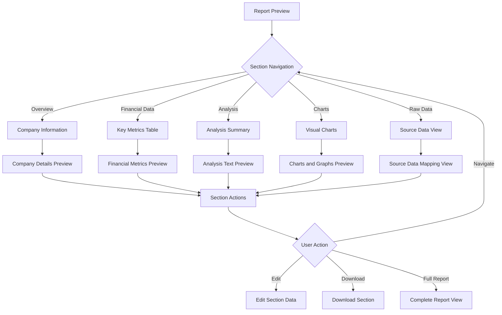
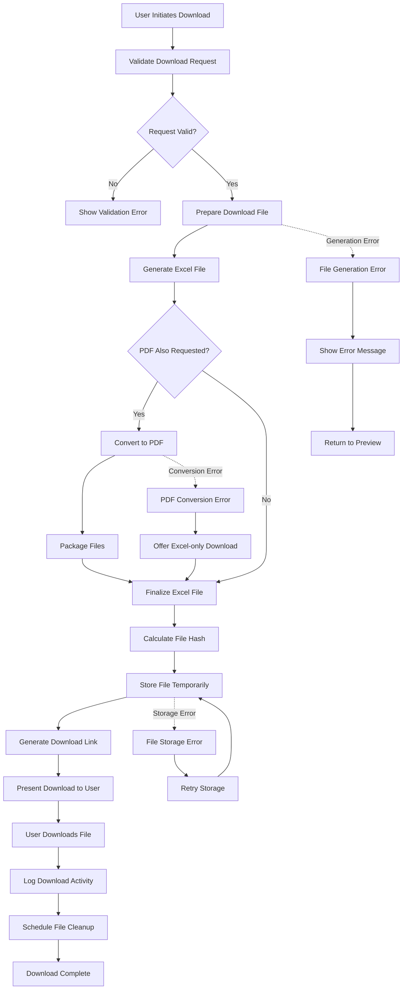
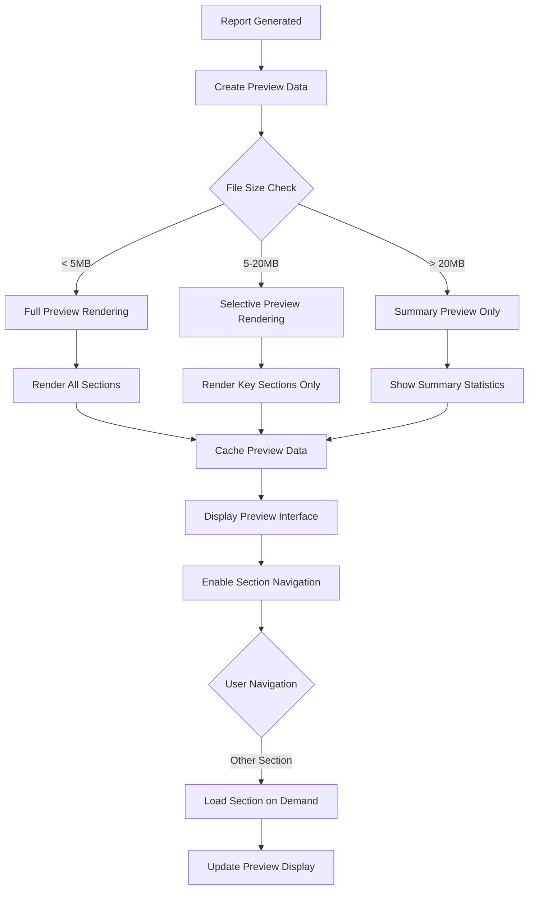
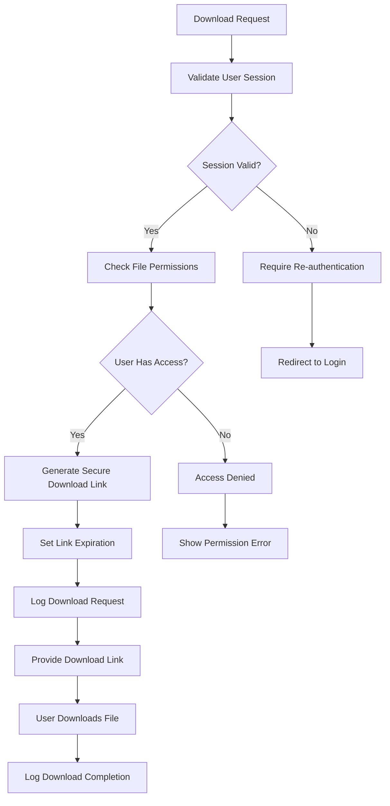

# Preview and Download Flow - Xem Trước và Tải Báo Cáo

## Overview

This document describes the user interaction flow for previewing generated reports and downloading final Excel files in the Khengleong system. This flow follows successful template selection and data mapping configuration.

## Business Requirements Supported

- **BR 5**: System shall allow preview and download of the generated report - High Priority
- **NFR 2**: Extract data within 5–25 seconds per document under normal load
- **NFR 9**: Intuitive UI for non-technical users with preview capabilities
- **NFR 10**: Audit/log all actions (download) with timestamps and user IDs

## Preview and Download Flow Diagram

```mermaid
graph TD
    A[Template and Mapping Confirmed] --> B[Initiate Report Generation]
    B --> C[Show Generation Progress]
    C --> D[AI Data Processing]
    D --> E[Apply Data Mapping]
    E --> F[Generate Excel Report]
    F --> G{Generation Success?}
    
    G -->|Yes| H[Display Success Message]
    G -->|No| I[Display Error Message]
    
    H --> J[Load Report Preview]
    I --> K[Show Error Details]
    K --> L[Offer Retry Options]
    L --> M{User Action}
    M -->|Retry| B
    M -->|Modify Mapping| N[Return to Template Selection]
    M -->|Upload New Files| O[Return to Upload]
    
    J --> P[Report Preview Interface]
    P --> Q{User Review}
    
    Q -->|Satisfied| R[Proceed to Download]
    Q -->|Need Changes| S[Edit Options Menu]
    Q -->|Preview Different Sections| T[Navigate Preview]
    
    S --> U{Edit Action}
    U -->|Modify Data| V[Data Correction Interface]
    U -->|Change Template| W[Return to Template Selection]
    U -->|Adjust Mapping| X[Fine-tune Mapping]
    
    V --> Y[Update Report Data]
    Y --> Z[Regenerate Report]
    Z --> J
    
    X --> AA[Mapping Adjustment Interface]
    AA --> BB[Validate New Mapping]
    BB --> CC{Validation Success?}
    CC -->|Yes| Z
    CC -->|No| DD[Show Mapping Errors]
    DD --> AA
    
    T --> EE[Section Navigation]
    EE --> FF[Display Section Details]
    FF --> Q
    
    R --> GG[Download Options Menu]
    GG --> HH{Download Format}
    HH -->|Excel (.xlsx)| II[Generate Excel Download]
    HH -->|PDF Report| JJ[Convert to PDF]
    HH -->|Both Formats| KK[Generate Both Files]
    
    II --> LL[Prepare Excel File]
    JJ --> MM[Generate PDF Version]
    KK --> NN[Prepare Both Files]
    
    LL --> OO[Download Excel File]
    MM --> PP[Download PDF File]
    NN --> QQ[Download Archive]
    
    OO --> RR[Log Download Activity]
    PP --> RR
    QQ --> RR
    
    RR --> SS[Download Complete]
    SS --> TT{User Next Action}
    
    TT -->|Generate New Report| UU[Return to Dashboard]
    TT -->|Modify Current Report| V
    TT -->|View Download History| VV[Download History]
    
    %% Error Handling
    D -.->|Processing Error| WW[Data Processing Error]
    F -.->|Generation Error| XX[Report Generation Error]
    LL -.->|File Error| YY[Download Preparation Error]
    
    WW --> ZZ[Show Processing Error]
    XX --> AAA[Show Generation Error]
    YY --> BBB[Show Download Error]
    
    ZZ --> L
    AAA --> L
    BBB --> CCC[Retry Download]
    CCC --> GG
    
    %% Styling
    classDef userAction fill:#e3f2fd,stroke:#1976d2,stroke-width:2px
    classDef systemProcess fill:#f3e5f5,stroke:#7b1fa2,stroke-width:2px
    classDef decision fill:#fff3e0,stroke:#f57c00,stroke-width:2px
    classDef error fill:#ffebee,stroke:#d32f2f,stroke-width:2px
    classDef success fill:#e8f5e8,stroke:#388e3c,stroke-width:2px
    classDef preview fill:#e1f5fe,stroke:#0277bd,stroke-width:2px
    
    class Q,U,M,TT userAction
    class B,C,D,E,F,J,LL,MM,NN,RR systemProcess
    class G,HH,CC decision
    class I,K,WW,XX,YY,ZZ,AAA,BBB,DD error
    class H,SS success
    class P,T,EE,FF,V,AA preview
```

## Report Generation Process

### Generation Progress Interface

```
┌─────────────────────────────────────────────────────────┐
│  ⚙️ Generating Report: Tencent Bond Analysis             │
│                                                         │
│  📊 Progress Status                                      │
│  ┌─────────────────────────────────────────────────────┐ │
│  │ ✅ Data extraction completed        (3.2s)          │ │
│  │ ✅ Field validation passed          (0.8s)          │ │
│  │ 🔄 Applying data mapping...         (2.1s)          │ │
│  │ ⏳ Generating Excel report...        (Est. 4s)      │ │
│  │ ⏳ Preparing preview...              (Est. 2s)      │ │
│  └─────────────────────────────────────────────────────┘ │
│                                                         │
│  Overall Progress: ████████████░░░░░░░░ 60%             │
│  Estimated completion: 8 seconds remaining              │
│                                                         │
│  Processing Files:                                      │
│  • financial_report_q1.pdf ✅                          │
│  • data_sheet.xlsx ✅                                  │
│                                                         │
│  [❌ Cancel Generation]                                  │
└─────────────────────────────────────────────────────────┘
```

### Generation Success Notification

```
┌─────────────────────────────────────────────────────────┐
│  ✅ Report Generated Successfully!                       │
│                                                         │
│  📋 Report Details:                                      │
│  • Template: Tencent Bond Analysis v2.1                │
│  • Generated: 2024-01-15 14:35:22                      │
│  • Processing time: 12.4 seconds                       │
│  • Data points mapped: 24/26 (92% coverage)           │
│  • File size: 2.3 MB                                   │
│                                                         │
│  [👁️ Preview Report] [⬇️ Download Now] [📧 Email Link]   │
└─────────────────────────────────────────────────────────┘
```

## Report Preview Interface

### Main Preview Layout

```
┌─────────────────────────────────────────────────────────┐
│  👁️ Report Preview: Tencent Bond Analysis               │
│                                                         │
│  🗂️ Sections: [Overview] [Financial Data] [Analysis] [Charts] │
│                                                         │
│  ┌─────────────────────────────────────────────────────┐ │
│  │                 📊 Excel Preview                    │ │
│  │                                                     │ │
│  │  A    B         C          D         E         F   │ │
│  │ ┌──┬─────┬─────────────┬──────────┬────────┬────────┐ │ │
│  │1│  │ISIN │HK0000123456 │          │        │        │ │ │
│  │2│  │Name │Tencent Bond │          │        │        │ │ │
│  │3│  │Rate │   3.25%     │          │        │        │ │ │
│  │4│  │     │             │          │        │        │ │ │
│  │5│  │Date │ 2025-12-31  │          │        │        │ │ │
│  │ └──┴─────┴─────────────┴──────────┴────────┴────────┘ │ │
│  │                                                     │ │
│  │  [🔍 Zoom In] [🔍 Zoom Out] [📋 Full Screen]       │ │
│  └─────────────────────────────────────────────────────┘ │
│                                                         │
│  ⚙️ Actions:                                            │
│  [✏️ Edit Data] [🔄 Change Template] [⬇️ Download]        │
│                                                         │
│  📈 Data Quality: 92% fields populated                  │
│  ⚠️ 2 fields require manual input                       │
│  [📝 View Missing Fields]                               │
└─────────────────────────────────────────────────────────┘
```

### Preview Navigation



## Data Validation and Quality Indicators

### Data Quality Dashboard

```
┌─────────────────────────────────────────────────────────┐
│  📊 Report Data Quality Overview                        │
│                                                         │
│  🎯 Overall Quality Score: 92% (Excellent)              │
│                                                         │
│  ✅ Successfully Mapped: 24 fields                      │
│  ⚠️ Partially Mapped: 2 fields                          │
│  ❌ Missing Data: 0 fields                              │
│                                                         │
│  📋 Field Status Details:                               │
│  ┌─────────────────────────────────────────────────────┐ │
│  │ Field Name           Status      Source      Action │ │
│  │ ──────────           ──────      ──────      ────── │ │
│  │ Bond ISIN           ✅ Mapped    PDF p.1     [View] │ │
│  │ Credit Rating       ✅ Mapped    PDF p.2     [View] │ │
│  │ Yield Rate          ✅ Mapped    Excel A5     [View] │ │
│  │ Maturity Date       ✅ Mapped    PDF p.1     [View] │ │
│  │ Risk Score          ⚠️ Partial   Calculated  [Edit] │ │
│  │ Analyst Comment     ⚠️ Manual    -           [Add]  │ │
│  └─────────────────────────────────────────────────────┘ │
│                                                         │
│  [🔍 View All Fields] [⚡ Auto-Complete] [✅ Accept All] │
└─────────────────────────────────────────────────────────┘
```

### Data Correction Interface

```
┌─────────────────────────────────────────────────────────┐
│  ✏️ Edit Field: Risk Score                              │
│                                                         │
│  📋 Current Value:                                       │
│  [7.2 (Calculated from credit rating)]                 │
│                                                         │
│  🔍 Data Sources:                                        │
│  • PDF Extract: "Credit rating AAA"                    │
│  • Excel Cell: B15 = "Low Risk"                        │
│  • Calculation: AAA → 7.2 (Low risk score)             │
│                                                         │
│  ✏️ Manual Override:                                     │
│  [7.5___] [Use Calculated Value] [Clear Field]          │
│                                                         │
│  💡 Validation Rules:                                   │
│  • Must be between 1.0 and 10.0                        │
│  • Higher score = higher risk                          │
│  • Should align with credit rating                     │
│                                                         │
│  [💾 Save Changes] [❌ Cancel] [❓ Get Help]              │
└─────────────────────────────────────────────────────────┘
```

## Download Options and Formats

### Download Menu Interface

```
┌─────────────────────────────────────────────────────────┐
│  ⬇️ Download Report Options                              │
│                                                         │
│  📊 Excel Format (Primary)                              │
│  ┌─────────────────────────────────────────────────────┐ │
│  │ ✅ .xlsx (Excel 2019/365 compatible)               │ │
│  │    File size: ~2.3 MB                              │ │
│  │    Includes: All formulas, formatting, charts     │ │
│  │    [⬇️ Download Excel]                              │ │
│  └─────────────────────────────────────────────────────┘ │
│                                                         │
│  📄 PDF Format (Preview)                                │
│  ┌─────────────────────────────────────────────────────┐ │
│  │ 📄 .pdf (Portable Document Format)                 │ │
│  │    File size: ~1.8 MB                              │ │
│  │    Includes: Static values, basic formatting      │ │
│  │    [⬇️ Download PDF]                                │ │
│  └─────────────────────────────────────────────────────┘ │
│                                                         │
│  📦 Package Download                                     │
│  ┌─────────────────────────────────────────────────────┐ │
│  │ 🗜️ .zip package (Complete set)                     │ │
│  │    Includes: Excel + PDF + Source data mapping    │ │
│  │    File size: ~4.5 MB                              │ │
│  │    [⬇️ Download Package]                            │ │
│  └─────────────────────────────────────────────────────┘ │
│                                                         │
│  ⚙️ Advanced Options:                                   │
│  ☑️ Include source file references                      │
│  ☑️ Add generation timestamp                            │
│  ☐ Email download link                                 │
│  ☐ Add to download history                             │
└─────────────────────────────────────────────────────────┘
```

### Download Progress Tracking



### Download Status Interface

```
┌─────────────────────────────────────────────────────────┐
│  ⬇️ Preparing Download...                                │
│                                                         │
│  📊 Generation Progress:                                 │
│  ┌─────────────────────────────────────────────────────┐ │
│  │ ✅ Finalizing Excel format...       Complete        │ │
│  │ 🔄 Converting to PDF...             75%             │ │
│  │ ⏳ Packaging files...                Pending         │ │
│  │ ⏳ Generating download link...       Pending         │ │
│  └─────────────────────────────────────────────────────┘ │
│                                                         │
│  Estimated time remaining: 8 seconds                   │
│  File size: 4.2 MB (compressed)                        │
│                                                         │
│  [❌ Cancel Download]                                    │
└─────────────────────────────────────────────────────────┘
```

## Download History and Management

### Download History Interface

```
┌─────────────────────────────────────────────────────────┐
│  📥 Download History                                     │
│                                                         │
│  🔍 Filter: [Last 30 days ▼] Template: [All ▼]          │
│                                                         │
│  📊 Recent Downloads                                     │
│  ┌─────────────────────────────────────────────────────┐ │
│  │ Date/Time         Template           Format    Size │ │
│  │ ─────────         ────────           ──────    ──── │ │
│  │ 2024-01-15 14:35  Tencent Bond      Excel    2.3MB │ │
│  │ 2024-01-15 13:20  Xiaomi Stock      PDF      1.8MB │ │
│  │ 2024-01-15 11:45  Risk Assessment   Package  4.1MB │ │
│  │ 2024-01-14 16:30  CPF Quarterly     Excel    3.2MB │ │
│  └─────────────────────────────────────────────────────┘ │
│                                                         │
│  Actions: [📧 Email Links] [🗑️ Clear History] [📊 Stats] │
│                                                         │
│  📈 Download Statistics:                                 │
│  • Total downloads this month: 15                      │
│  • Most used template: Tencent Bond Analysis           │
│  • Average file size: 2.8 MB                          │
└─────────────────────────────────────────────────────────┘
```

## Error Scenarios and Recovery

### Common Error Types

| Error Category | Specific Errors | User Message | Recovery Action |
|----------------|-----------------|-------------|-----------------|
| **Generation Errors** | Insufficient data, mapping conflicts | "Report generation failed due to incomplete data mapping. Please review and complete all required fields." | Return to mapping interface |
| **File System Errors** | Disk space, permissions | "Unable to generate download file. Please try again or contact support." | Retry with notification to admin |
| **Format Conversion** | PDF conversion failure | "Excel file ready, but PDF conversion failed. Would you like to download Excel only?" | Offer Excel-only download |
| **Network Issues** | Download interruption | "Download interrupted. Click here to resume or restart download." | Resume download capability |
| **Size Limitations** | File too large | "Generated file exceeds size limit. Please try a simplified template or contact support." | Suggest alternative templates |

### Error Recovery Interface

```
┌─────────────────────────────────────────────────────────┐
│  ❌ Report Generation Error                              │
│                                                         │
│  ⚠️ Issue Detected:                                      │
│  The report could not be generated due to incomplete    │
│  data mapping. 2 required fields are missing values.   │
│                                                         │
│  🔍 Missing Fields:                                      │
│  • Risk Score (Cell D15)                               │
│  • Analyst Rating (Cell F20)                           │
│                                                         │
│  🛠️ Suggested Actions:                                   │
│  ○ Complete missing fields manually                    │
│  ○ Use default values for missing fields               │
│  ○ Select a different template                         │
│  ○ Upload additional source documents                  │
│                                                         │
│  [✏️ Complete Fields] [🔄 Use Defaults] [❌ Cancel]      │
└─────────────────────────────────────────────────────────┘
```

## Performance Optimization

### Preview Rendering



### Download Optimization

| File Size Range | Optimization Strategy | Implementation |
|-----------------|----------------------|----------------|
| **< 1MB** | Direct download | Immediate file generation and download |
| **1-5MB** | Progress indicator | Show progress bar during generation |
| **5-20MB** | Background processing | Generate in background, notify when ready |
| **> 20MB** | Chunked download | Split into smaller chunks, resume capability |

## Security Considerations

### Download Security



### File Security Measures

| Security Aspect | Implementation | Purpose |
|-----------------|----------------|---------|
| **Link Expiration** | 24-hour expiry on download links | Prevent unauthorized access |
| **Access Logging** | Log all download attempts | Audit trail and security monitoring |
| **File Scanning** | Virus scan generated files | Prevent malware distribution |
| **Encryption** | HTTPS for all downloads | Protect data in transit |
| **Access Control** | User-specific file access | Ensure only authorized downloads |

## Integration Points

### 1. With Template Selection Flow
- Receive template configuration and mapping rules
- Inherit data validation requirements
- Pass back preview feedback for template optimization

### 2. With Document Upload Flow
- Access original source documents for reference
- Display source-to-output data lineage
- Enable re-processing with updated source data

### 3. With Error Handling Flow
- Comprehensive error reporting and recovery
- User guidance for error resolution
- Escalation paths for technical issues

### 4. With Audit System
- Complete activity logging for compliance
- Download tracking for usage analytics
- Security event monitoring

## User Experience Enhancements

### Accessibility Features

| Feature | Implementation | Benefit |
|---------|----------------|---------|
| **Keyboard Navigation** | Full keyboard support for preview | Accessibility compliance |
| **Screen Reader Support** | ARIA labels for all elements | Visual impairment support |
| **High Contrast Mode** | Alternative color schemes | Visual accessibility |
| **Text Scaling** | Responsive text sizing | Reading accessibility |

### Mobile Responsiveness

```
Mobile Preview Layout:
┌─────────────────────┐
│  👁️ Report Preview   │
│                     │
│  [Overview ▼]       │
│                     │
│  📊 Excel Preview   │
│  ┌─────────────────┐ │
│  │     A    B      │ │
│  │ 1  ISIN  HK0000 │ │
│  │ 2  Name  Tencent│ │
│  │ 3  Rate  3.25%  │ │
│  └─────────────────┘ │
│                     │
│  [⬇️ Download]       │
│  [✏️ Edit]           │
│  [🔄 Template]       │
└─────────────────────┘
```

### Progressive Web App Features

- **Offline Preview**: Cache generated reports for offline viewing
- **Background Sync**: Queue downloads when connection is restored
- **Push Notifications**: Notify users when large reports are ready
- **App-like Experience**: Full-screen preview mode, native feel