# Error Handling and Notifications Flow - Xử Lý Lỗi và Thông Báo

## Overview

This document describes the comprehensive error handling and notification system for the Khengleong Financial Report Generation System. It covers error detection, classification, user notification, recovery mechanisms, and system monitoring.

## Business Requirements Supported

- **BR 8**: Users shall receive error messages if extraction or mapping fails - High Priority
- **NFR 4**: 99% uptime, excluding scheduled maintenance
- **NFR 10**: Audit/log all actions (including errors) with timestamps and user IDs
- **NFR 9**: Intuitive UI for non-technical users with clear error messages

## Error Handling Flow Diagram

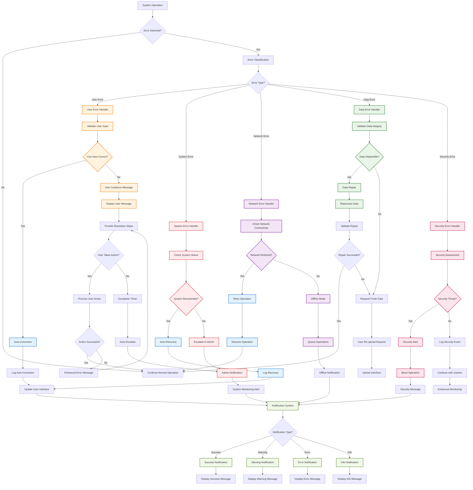

## Error Classification System

### Error Categories and Hierarchy

```mermaid
graph TD
    A[All Errors] --> B[User Errors]
    A --> C[System Errors]
    A --> D[Network Errors]
    A --> E[Data Errors]
    A --> F[Security Errors]
    
    B --> B1[Input Validation]
    B --> B2[File Format]
    B --> B3[Permission Denied]
    B --> B4[Workflow Violation]
    
    C --> C1[Server Errors]
    C --> C2[Database Errors]
    C --> C3[Processing Errors]
    C --> C4[Resource Exhaustion]
    
    D --> D1[Connection Timeout]
    D --> D2[Service Unavailable]
    D --> D3[DNS Resolution]
    D --> D4[Bandwidth Issues]
    
    E --> E1[Corrupted Files]
    E --> E2[Missing Data]
    E --> E3[Format Mismatch]
    E --> E4[Extraction Failure]
    
    F --> F1[Authentication]
    F --> F2[Authorization]
    F --> F3[Malware Detection]
    F --> F4[Suspicious Activity]
```

### Error Severity Levels

| Level | Description | User Impact | Response Time | Escalation |
|-------|-------------|-------------|---------------|------------|
| **Critical** | System unavailable, data loss risk | Complete service disruption | Immediate | Automatic admin alert |
| **High** | Major functionality broken | Core features unavailable | < 1 minute | Immediate notification |
| **Medium** | Feature degradation | Some features limited | < 5 minutes | Scheduled notification |
| **Low** | Minor issues | Minor inconvenience | < 15 minutes | Logged only |
| **Info** | Status updates | No functional impact | As needed | User notification only |

## User Error Handling

### Input Validation Errors

```
┌─────────────────────────────────────────────────────────┐
│  ⚠️ File Upload Error                                    │
│                                                         │
│  ❌ Issue: Invalid file format                          │
│                                                         │
│  📄 File: "report_data.txt"                            │
│  🔍 Problem: Only PDF and Excel files are supported     │
│                                                         │
│  💡 What you can do:                                    │
│  • Convert your file to PDF or Excel format            │
│  • Use a different file that contains the same data    │
│  • Contact support if you need help with conversion    │
│                                                         │
│  📚 Supported formats:                                  │
│  • PDF documents (.pdf)                                │
│  • Excel files (.xlsx, .xls)                          │
│  • Maximum file size: 50MB                             │
│                                                         │
│  [🔄 Try Again] [📞 Contact Support] [❓ Help]          │
└─────────────────────────────────────────────────────────┘
```

### Workflow Violation Errors

```
┌─────────────────────────────────────────────────────────┐
│  🚫 Workflow Error                                       │
│                                                         │
│  ❌ Issue: Cannot generate report                       │
│                                                         │
│  🔍 Problem: No documents have been uploaded yet        │
│                                                         │
│  📋 Required steps:                                      │
│  1. ✅ Login to system                                   │
│  2. ❌ Upload source documents                          │
│  3. ❌ Select output template                           │
│  4. ❌ Generate report                                  │
│                                                         │
│  💡 Next steps:                                         │
│  Click "Upload Documents" to add your source files     │
│  before proceeding with report generation.             │
│                                                         │
│  [📁 Upload Documents] [❓ Help] [🏠 Dashboard]          │
└─────────────────────────────────────────────────────────┘
```

## System Error Handling

### Server Error Response

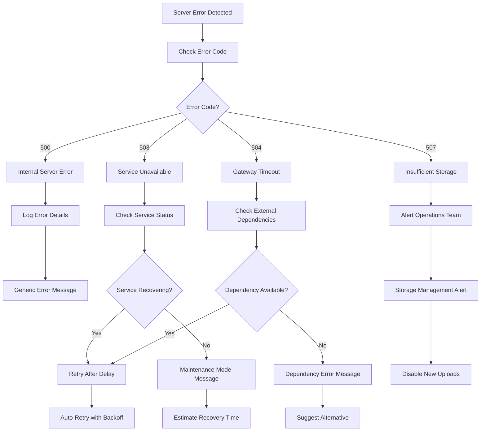

### Database Error Handling

```
┌─────────────────────────────────────────────────────────┐
│  🔧 System Temporarily Unavailable                      │
│                                                         │
│  ❌ Issue: Database connection error                    │
│                                                         │
│  🔍 What happened:                                      │
│  Our system is experiencing technical difficulties     │
│  and cannot process your request right now.            │
│                                                         │
│  ⏰ Estimated resolution: 15 minutes                    │
│                                                         │
│  💡 What you can do:                                    │
│  • Wait a few minutes and try again                    │
│  • Your work has been automatically saved              │
│  • Check our status page for updates                   │
│                                                         │
│  🔄 Auto-retry in: 60 seconds                          │
│                                                         │
│  [🔄 Retry Now] [📊 Status Page] [📞 Support]           │
└─────────────────────────────────────────────────────────┘
```

## Network Error Handling

### Connection Issues

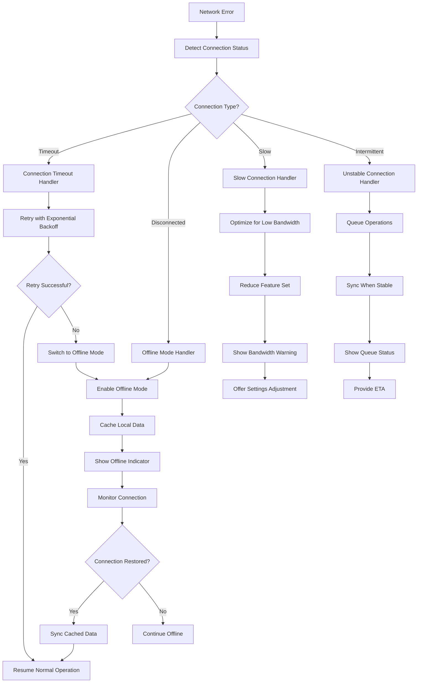

### Offline Mode Interface

```
┌─────────────────────────────────────────────────────────┐
│  📡 Offline Mode                                         │
│                                                         │
│  ⚠️ No internet connection detected                     │
│                                                         │
│  🔄 Available actions while offline:                    │
│  ✅ View previously generated reports                   │
│  ✅ Browse downloaded templates                         │
│  ✅ Review your work from this session                 │
│  ❌ Upload new documents                               │
│  ❌ Generate new reports                               │
│  ❌ Download reports                                   │
│                                                         │
│  💾 Your recent work has been saved locally            │
│  and will sync when connection is restored.           │
│                                                         │
│  🔄 Checking connection... (last check: 30s ago)       │
│                                                         │
│  [🔄 Check Now] [📊 View Offline Data] [⚙️ Settings]    │
└─────────────────────────────────────────────────────────┘
```

## Data Error Handling

### File Corruption Detection

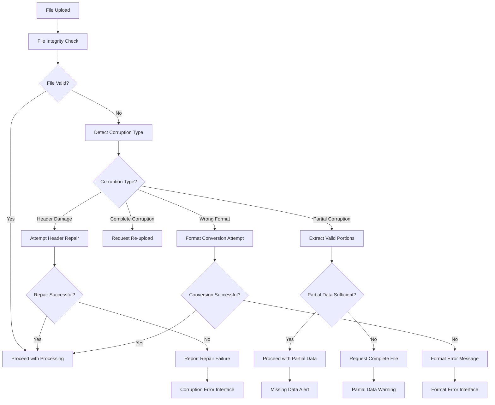

### Data Extraction Errors

```
┌─────────────────────────────────────────────────────────┐
│  🔍 Data Extraction Error                               │
│                                                         │
│  ❌ Issue: Unable to extract data from document         │
│                                                         │
│  📄 File: "financial_report_q1.pdf"                    │
│  🔍 Problem: Document appears to be scanned/image-based │
│                                                         │
│  📊 Extraction Results:                                 │
│  • Text extracted: 15% (Low quality)                   │
│  • Tables detected: 0 of 3 expected                    │
│  • Data fields found: 2 of 12 required                │
│                                                         │
│  💡 Suggested solutions:                                │
│  • Upload a text-based PDF instead of scanned image    │
│  • Provide data in Excel format if available           │
│  • Use OCR software to convert scanned PDF to text     │
│  • Contact the document provider for a digital copy    │
│                                                         │
│  [📤 Upload Different File] [🔄 Retry Extraction]       │
│  [📞 Contact Support] [❓ Help with OCR]                │
└─────────────────────────────────────────────────────────┘
```

### Template Mapping Errors

```
┌─────────────────────────────────────────────────────────┐
│  🔗 Data Mapping Error                                   │
│                                                         │
│  ❌ Issue: Cannot map extracted data to template        │
│                                                         │
│  📊 Template: "Tencent Bond Analysis v2.1"             │
│  🔍 Problem: Required fields missing from source data   │
│                                                         │
│  📋 Mapping Status:                                      │
│  ✅ Successfully mapped: 8 fields                       │
│  ⚠️ Partially mapped: 2 fields                          │
│  ❌ Missing data: 3 fields                              │
│                                                         │
│  🔍 Missing Required Fields:                             │
│  • Credit Rating (Required for risk calculation)       │
│  • Maturity Date (Required for yield analysis)         │
│  • Coupon Rate (Required for income projection)        │
│                                                         │
│  💡 Options to resolve:                                 │
│  • Upload additional documents containing missing data │
│  • Manually enter the missing values                   │
│  • Choose a different template with fewer requirements │
│  • Contact support for data extraction assistance      │
│                                                         │
│  [✏️ Manual Entry] [📁 Upload More Files]               │
│  [🔄 Try Different Template] [📞 Get Help]              │
└─────────────────────────────────────────────────────────┘
```

## Security Error Handling

### Malware Detection

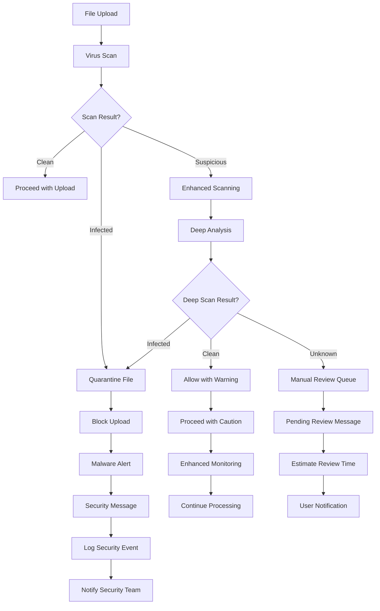

### Authentication Errors

```
┌─────────────────────────────────────────────────────────┐
│  🔐 Authentication Required                              │
│                                                         │
│  ❌ Issue: Your session has expired                     │
│                                                         │
│  🔍 What happened:                                      │
│  For security reasons, you've been logged out after    │
│  30 minutes of inactivity.                             │
│                                                         │
│  💾 Don't worry:                                        │
│  Your work has been automatically saved and will be    │
│  restored when you log back in.                        │
│                                                         │
│  🔒 Security features:                                   │
│  • Automatic session timeout for protection            │
│  • Secure data encryption                              │
│  • Automatic work saving                               │
│                                                         │
│  [🔑 Log In Again] [❓ Help] [📧 Contact Admin]          │
└─────────────────────────────────────────────────────────┘
```

## Notification System

### Notification Types and Delivery

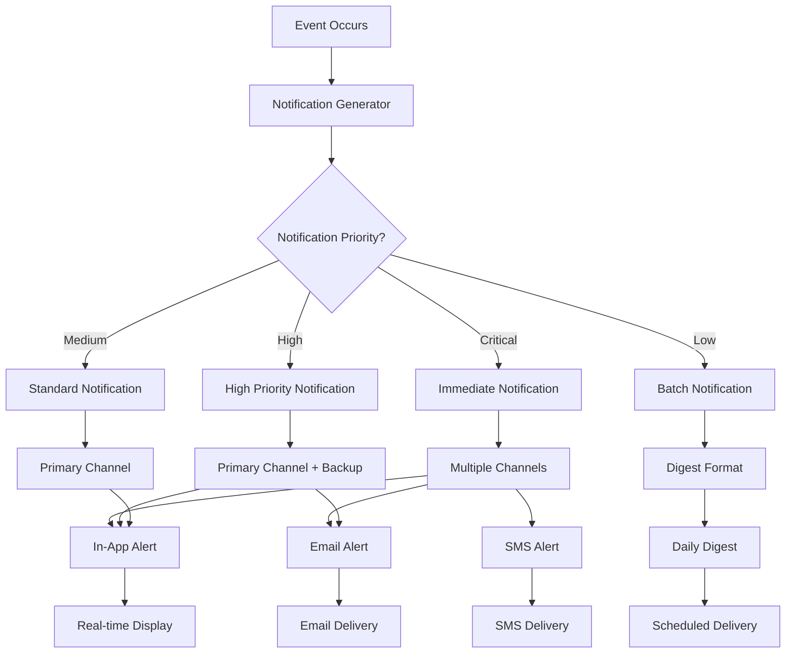

### In-App Notification Interface

```
┌─────────────────────────────────────────────────────────┐
│  🔔 Notifications (3)                                   │
│                                                         │
│  ┌─────────────────────────────────────────────────────┐ │
│  │ ✅ Report Generated Successfully        2 min ago   │ │
│  │    Tencent Bond Analysis is ready for download      │ │
│  │    [⬇️ Download] [👁️ Preview] [✕]                    │ │
│  └─────────────────────────────────────────────────────┘ │
│                                                         │
│  ┌─────────────────────────────────────────────────────┐ │
│  │ ⚠️ Template Update Available         15 min ago     │ │
│  │    Risk Assessment v2.2 has improvements            │ │
│  │    [📥 Update] [📋 Details] [✕]                      │ │
│  └─────────────────────────────────────────────────────┘ │
│                                                         │
│  ┌─────────────────────────────────────────────────────┐ │
│  │ ℹ️ Scheduled Maintenance             1 hour ago     │ │
│  │    System maintenance tonight 2-4 AM                │ │
│  │    [📅 Details] [⏰ Reminder] [✕]                    │ │
│  └─────────────────────────────────────────────────────┘ │
│                                                         │
│  [📋 View All] [⚙️ Settings] [🔔 Mark All Read]          │
└─────────────────────────────────────────────────────────┘
```

### Toast Notifications

```
Success Toast:
┌───────────────────────────────────┐
│ ✅ File uploaded successfully     │
│    processing_report.pdf          │
│                            [✕]   │
└───────────────────────────────────┘

Warning Toast:
┌───────────────────────────────────┐
│ ⚠️ Large file detected            │
│    Processing may take longer     │
│                            [✕]   │
└───────────────────────────────────┘

Error Toast:
┌───────────────────────────────────┐
│ ❌ Upload failed                   │
│    Click to retry                 │
│                            [✕]   │
└───────────────────────────────────┘
```

## Error Recovery Mechanisms

### Automatic Recovery

| Error Type | Recovery Method | Success Rate | Fallback |
|------------|-----------------|--------------|----------|
| **Network Timeout** | Exponential backoff retry | 85% | Manual retry |
| **Database Lock** | Queue operation, retry | 95% | Alternative query |
| **File Corruption** | Attempt repair, re-request | 60% | User re-upload |
| **Memory Issues** | Garbage collection, restart | 90% | Process queue |
| **Template Error** | Use previous version | 70% | Manual selection |

### Recovery Progress Interface

```
┌─────────────────────────────────────────────────────────┐
│  🔄 Automatic Recovery in Progress                       │
│                                                         │
│  ❌ Issue: Database connection lost                     │
│  🔧 Recovery: Attempting to reconnect...               │
│                                                         │
│  📊 Progress:                                           │
│  ┌─────────────────────────────────────────────────────┐ │
│  │ ✅ Check network connectivity        Complete       │ │
│  │ 🔄 Reconnect to database...          In progress   │ │
│  │ ⏳ Restore session state...           Pending       │ │
│  │ ⏳ Resume your work...                Pending       │ │
│  └─────────────────────────────────────────────────────┘ │
│                                                         │
│  Attempt 2 of 3 | Estimated time: 15 seconds           │
│                                                         │
│  [❌ Cancel Recovery] [📞 Contact Support]               │
└─────────────────────────────────────────────────────────┘
```

## Error Analytics and Monitoring

### Error Dashboard for Administrators

```
┌─────────────────────────────────────────────────────────┐
│  📊 Error Analytics Dashboard                           │
│                                                         │
│  📈 Error Trends (Last 24 Hours)                        │
│  ┌─────────────────────────────────────────────────────┐ │
│  │     │                                               │ │
│  │  20 │     ⚠️                                       │ │
│  │     │    /  \                                      │ │
│  │  15 │   /    \                                     │ │
│  │     │  /      \                                    │ │
│  │  10 │ /        \___                                │ │
│  │     │/             \___                            │ │
│  │   5 │                  \____                       │ │
│  │     └─────────────────────────\____                │ │
│  │     0   6   12   18   24 (hours)                   │ │
│  └─────────────────────────────────────────────────────┘ │
│                                                         │
│  🔥 Top Error Categories:                               │
│  1. File Upload Errors: 45 (32%)                      │
│  2. Data Extraction Errors: 38 (27%)                  │
│  3. Network Timeouts: 22 (16%)                        │
│  4. Template Mapping: 20 (14%)                        │
│  5. Authentication: 15 (11%)                          │
│                                                         │
│  🚨 Critical Issues (Require Attention):               │
│  • Database connection pool exhaustion                 │
│  • Disk space warning (85% full)                      │
│  • High memory usage on server-02                     │
│                                                         │
│  [📧 Email Report] [🔄 Refresh] [⚙️ Settings]           │
└─────────────────────────────────────────────────────────┘
```

### Error Reporting and Escalation

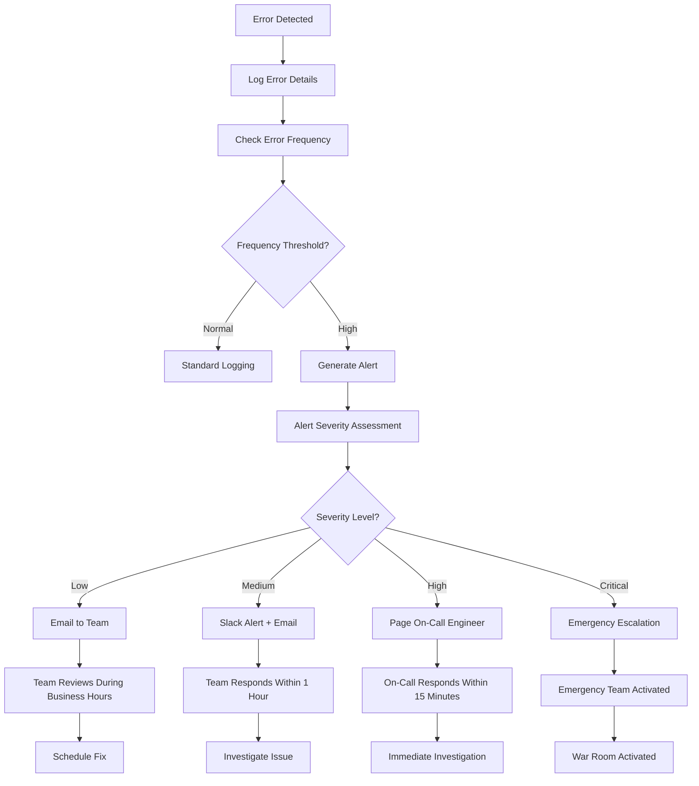

## User Guidance and Help

### Contextual Help System

```
┌─────────────────────────────────────────────────────────┐
│  ❓ Getting Help                                         │
│                                                         │
│  🎯 For your current issue:                             │
│  "File upload failed - network error"                  │
│                                                         │
│  📚 Suggested solutions:                                │
│  1. Check your internet connection                     │
│  2. Try uploading a smaller file                       │
│  3. Disable VPN if you're using one                    │
│  4. Try again in a few minutes                         │
│                                                         │
│  📺 Video Tutorial: "Troubleshooting Upload Issues"     │
│  [▶️ Watch Tutorial (2:30)]                             │
│                                                         │
│  📖 Documentation:                                       │
│  • [File Upload Requirements]                          │
│  • [Supported File Formats]                            │
│  • [Network Troubleshooting]                           │
│                                                         │
│  🆘 Still need help?                                    │
│  [💬 Live Chat] [📧 Email Support] [📞 Call Support]    │
│                                                         │
│  📋 Report a Bug:                                       │
│  [🐛 Submit Bug Report]                                 │
└─────────────────────────────────────────────────────────┘
```

### Progressive Error Resolution

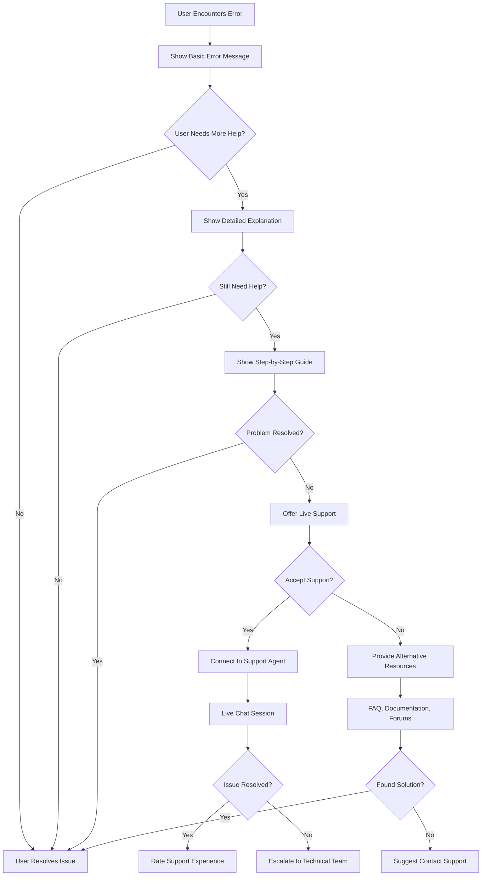

## Integration with Other Flows

### Error Context Preservation

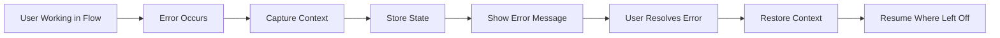

### Cross-Flow Error Handling

| Source Flow | Common Errors | Recovery Actions | Integration Points |
|-------------|---------------|------------------|-------------------|
| **Document Upload** | File corruption, size limits | Re-upload, format conversion | Template selection awareness |
| **Template Selection** | Template unavailable, mapping conflicts | Alternative templates, manual mapping | Document context preservation |
| **Template Management** | Permission denied, validation errors | Role escalation, error correction | User permission integration |
| **Preview/Download** | Generation failure, network issues | Retry mechanism, offline mode | Progress state management |

## Performance Impact Considerations

### Error Handling Optimization

| Optimization | Implementation | Benefit |
|-------------|----------------|---------|
| **Error Caching** | Cache common error responses | Reduce server load |
| **Lazy Error Loading** | Load error details on demand | Faster initial response |
| **Error Batching** | Group related errors | Reduce notification noise |
| **Smart Retry** | Intelligent retry intervals | Prevent system overload |
| **Error Compression** | Compress error log data | Reduce storage and bandwidth |

### Resource Management During Errors

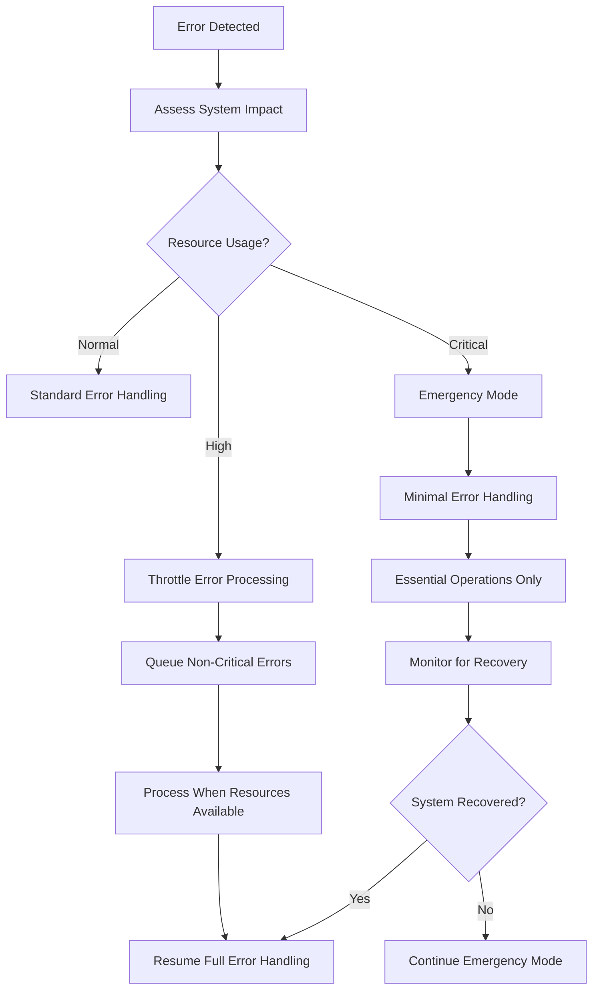

This comprehensive error handling and notification system ensures that users receive clear, actionable feedback for all types of errors while maintaining system stability and providing effective recovery mechanisms.